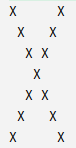

# Упражнение. Двумерные массивы

Реализуйте методы:
- `getTwoDimensionalArray`, который должен создать двумерный массив размера size (нечетное число), на диагоналях которого должны быть символы Х, в остальных ячейках пробел.
- `getStringArray`, который принимает в себя двумерный массив символов и возвращает этот двумерный массив в виде строки. Если распечатать массив сформированный методом `getTwoDimensionalArray` с аргументом 7, то получим:

<p float="left">  </p>

**Все тесты пройдены, задача сдана:**
```java
public static char[][] getTwoDimensionalArray(int size) {
    if (size % 2 == 0)
        throw new IllegalArgumentException("Размер должен быть нечетным");

    char[][] array = new char[size][size];

    for (int i = 0; i < size; i++)
        for (int j = 0; j < size; j++)
            if (i == j || i + j == size - 1) array[i][j] = 'X';
            else array[i][j] = ' ';

    return array;
}

public static String getStringArray(char[][] charArray){
    StringBuilder result = new StringBuilder();

    for (char[] chars : charArray) {
        result.append(chars);
        result.append(System.lineSeparator());
    }

    return result.toString();
}
```
