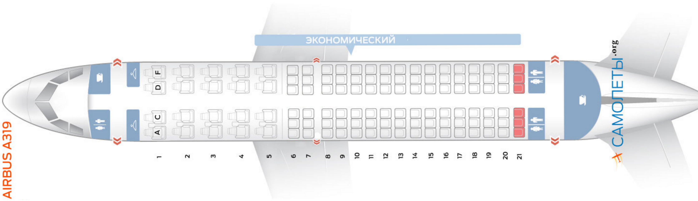

# Точки сохранения

У самолета с кодом `319` у мест поменялся класс обслуживания. Первые пять рядов должны быть класса `Comfort` (сейчас у них класс `Business`), а все остальные класса `Economy`. Также нужно удалить все места из 21 ряда.

<p float="left">  </p>

**Задание**

Все действия нужно выполнить в одном блоке транзакции.
1. [Освежи знания по документации](https://postgrespro.ru/docs/postgresql/13/sql-savepoint)
2. [Посмотри синтаксис команды ROLLBACK TO](https://postgrespro.ru/docs/postgresql/13/sql-rollback-to)
3. Поменяйте класс обслуживания у мест
4. Добавьте точку сохранения
5. Удалите **ВСЕ** места в самолете
6. Откатитесь к точке сохранения
7. Удалите только нужные места

**Все тесты пройдены, задача сдана:**
```pgsql
Begin;

-- Первые 5 рядов: Business → Comfort
Update seats 
Set fare_conditions = 'Comfort' 
Where aircraft_code = '319' 
  And fare_conditions = 'Business'
  And Cast(Substring(seat_no From '^([0-9]+)') as Integer) <= 5;

-- Все остальные ряды: любой класс → Economy
Update seats 
Set fare_conditions = 'Economy' 
Where aircraft_code = '319' 
  And Cast(Substring(seat_no From '^([0-9]+)') as Integer) > 5;

Savepoint before_delete;

Delete From seats 
Where aircraft_code = '319';

Rollback To before_delete;

-- Удалить 21 ряд
Delete From seats 
Where aircraft_code = '319' 
  And Cast(Substring(seat_no From '^([0-9]+)') as Integer) = 21;

Commit;
```
