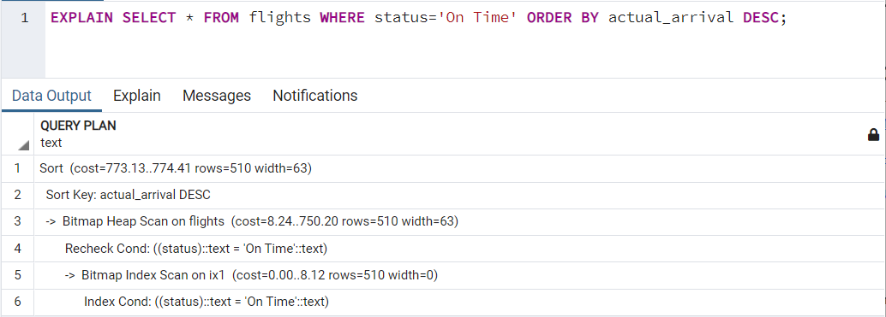
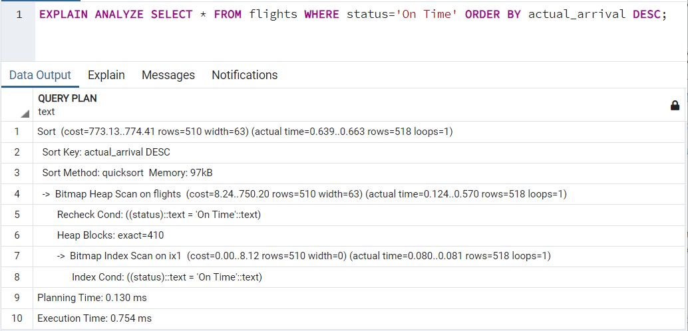
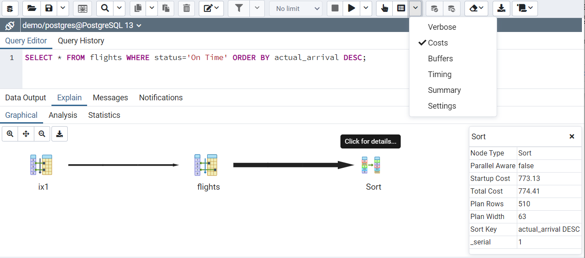

# Плана запроса, EXPLAIN

**Как БД исполняет запрос**

Полезно знать, как БД выполняет запрос:
1. Сначала БД проводит синтаксический анализ, определяя какие колонки нужно получить, из каких таблиц, какие условия фильтрации и т.п.
2. БД переписывает запрос в удобном для себя виде.
3. Строит возможные планы выполнения запросов. Их может быть несколько, т.к. SQL это декларативный язык.
4. Выбирает оптимальный план с использованием накопленной статистики.
5. Выполняет план.
6. Возвращает результат.

**Опционально** можно посмотреть первые 28 минут видео про то как БД выполняет запрос - https://www.youtube.com/watch?v=isFZ0wFnJg8

**EXPLAIN**

<p float="left">  </p>

При выполнении любого запроса БД пытается выбирать оптимальный план его выполнения. Посмотреть итоговый план запроса можно с помощью оператора `EXPLAIN`.

Пример:

`EXPLAIN SELECT * FROM flights WHERE status='On Time' ORDER BY actual_arrival DESC;`

План древовидный. В плане запроса видно:
- Порядок выполнения запроса - выполнение идёт от листьев к корневому узлу.
- Тип доступа к данным на каждом узле: Последовательное сканирование (SeqScan), Индексное сканирование (IndexScan), Только сканирование индекса (Index Only Scan), Сканирование битовой карты (Bitmap Index Scan), и др.
- Операции с данными: Фильтрации, Сортировки, Инкрементальные сортировки, Limit и др.
- Оценки стоимости выполнения для каждого узла: Стоимость подготовки, Стоимость выполнения, Количество строк в результате, Средний размер строки. Стоимость операций для узла верхнего уровня — это сумма стоимостей операций узлов, входящих в его состав, плюс дополнительные издержки.

Не следует сравнивать оценки для разных запросов.

**EXPLAIN ANALYZE**

<p float="left">  </p>

Команда `EXPLAIN ANALYZE` **выполняет указанный запрос**, а не только планирует его. План запроса дополняется фактическими данными о времени выполнения и числе строк в каждом узле плана.

Пример:

`EXPLAIN ANALYZE SELECT * FROM flights WHERE status='On Time' ORDER BY actual_arrival DESC;`

**Просмотр плана в графическом виде**

<p float="left">  </p>

В PGAdmin план запроса можно смотреть в графическом виде. Для этого в QueryTool нужно написать сам запрос и нажать в панели инструментов на кнопку «с пальцем» или `F7`.

Для просмотра графического плана `EXPLAIN ANALYZE` надо нажать на соседнюю кнопку или `Shift+F7`.

Чтобы в графическом плане были видны оценки выполнения операций - надо добавить опцию Costs в дропдаун меню.

**ANALYZE**

При выборе оптимального плана БД ориентируется на статистику по данным в таблице. Статистика обновляется автоматически. Но после больших изменений следует вручную запустить пересчёт статистики, выполнив команду [ANALYZE](https://postgrespro.ru/docs/postgresql/13/sql-analyze).

**Дополнительная информация**

**Настоятельно рекомендую** посмотреть 13 минут видео (с 22 до 35 минуты) про анализ плана: https://youtu.be/BNHLk2mHrsA?t=1371

**Желательно:** прочитать в документации про [особенности анализа плана запроса](https://postgrespro.ru/docs/postgresql/13/using-explain).

**Опционально:** смотри в документации [синтаксис команды EXPLAIN](https://postgrespro.ru/docs/postgresql/13/sql-explain).

**Задание**
1. Открой PGAdmin, выбери демо-базу.
2. Получи план запроса с помощью оператора `EXPLAIN` для запроса `SELECT * FROM flights WHERE status='On Time' ORDER BY actual_arrival DESC;`
3. Изучи текстовый план: последовательность, оценку в каждом узле, тип доступа.
4. Посмотри графический план для команды `EXPLAIN`.
5. Получи расширенный план запроса с помощью оператора `EXPLAIN ANALYZE` для запроса `SELECT * FROM flights WHERE status='On Time' ORDER BY actual_arrival DESC;`
6. Посмотри план в текстовом виде, в том числе фактическое время выполнение и количество затронутых строк.
7. Посмотри графический план для команды `EXPLAIN ANALYZE`.
8. Сравни информацию.
9. В ответ напиши основной тип доступа к данным из двух слов, как он написан в плане.

**Все тесты пройдены, задача сдана:**
```pgsql
Seq Scan
```
