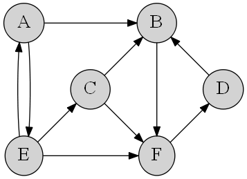

# Задача 11

Укажите компоненты сильной связности следующих орграфов, перечислив для каждой из них входящие в неё вершины.

Внутри каждой компоненты связности перечислите вершины в алфавитном порядке, разделенные точкой с запятой. Компоненты связности заключаются в фигурные скобки и разделяются точкой с запятой.

Пример оформления ответа для двух компонент связности: `{A;B;C};{D;E}`

1. Компоненты связности (1 из 1 балла)
   * 🟢 `{A;E};{B;D;F};{C}` (Правильный ответ: {A;E};{B;D;F};{C})

2. Компоненты связности (1 из 1 балла)
   * 🟢 `{A;B;C;D;E;F}` (Правильный ответ: {A;B;C;D;E;F})
