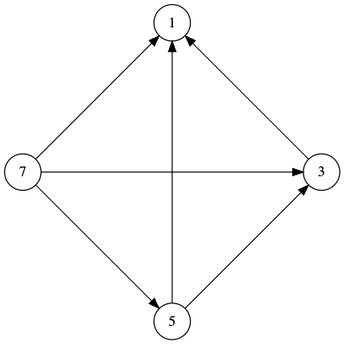

# Задача 11

На множестве {1;3;5;7} задано отношение, изображенное следующим орграфом:

1. Укажите, какими свойствами обладает отношение *R*? (1 из 1 балла)
   * ❌ **рефлексивность**
   * ❌ **симметричность**
   * ✅ **транзитивность** (Правильно!)
   * ✅ **антисимметричность** (Правильно!)

Как обычно называют это отношение?
