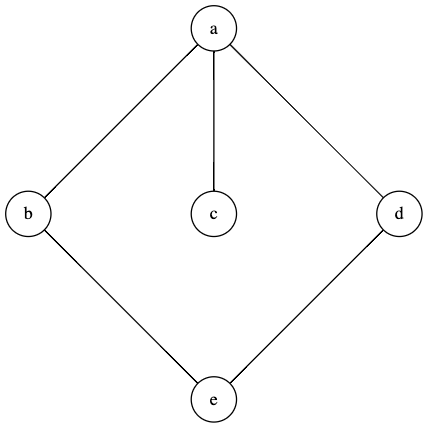

# Задача 14

На рисунке изображена диаграмма Хассе некоторого отношения порядка *R* на множестве M={a;b;c;d;e}.

1. Сколько элементов содержит отношение *R*? (1 из 1 балла)
   * 🟢 `11` (Правильный ответ: 11)

2. Сколько элементов множества *R* принадлежит отношению непосредственного предшествования? (1 из 1 балла)
   * 🟢 `5` (Правильный ответ: 5)

В пунктах 3-6 в качестве ответа запишите множество, перечисляя элементы в алфавитном порядке, разделяя их точкой с запятой без пробелов, или `пусто`, если множество пусто. Например, `{a;b;e}`

3. Каково множество наибольших элементов множества *M*? (1 из 1 балла)
   * 🟢 `{a}` (Правильный ответ: {a})

4. Каково множество максимальных элементов множества *M*? (1 из 1 балла)
   * 🟢 `{a}` (Правильный ответ: {a})

5. Каково множество наименьших элементов множества *M*? (1 из 1 балла)
   * 🟢 `пусто` (Правильный ответ: пусто)

6. Каково множество минимальных элементов множества *M*? (1 из 1 балла)
   * 🟢 `{c;e}` (Правильный ответ: {c;e})
