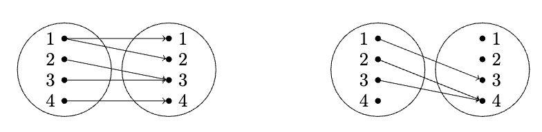

# Задача 6

Пусть X={1,2,3,4}. Отображения *f:X→X* и *g:X→X* заданы так, как показано на соответсвующих орграфах

Укажите, сколько среди отображений *f,g,f∘g,g∘f* обладают свойствами:

1. всюду определённости (1 из 1 балла)
   * 🟢 `1` (Правильный ответ: 1)

2. однозначности (1 из 1 балла)
   * 🟢 `2` (Правильный ответ: 2)

3. инъективности (1 из 1 балла)
   * 🟢 `0` (Правильный ответ: 0)

4. сюръективности (1 из 1 балла)
   * 🟢 `1` (Правильный ответ: 1)

5. Укажите инстинное высказывание (1 из 1 балла)
   * 🔴 ***f∘g=g∘f***
   * 🔴 ***f∘g⊂g∘f***
   * 🟢 ***f∘g⊃g∘f*** (Правильно!)
   * 🔴 ***f∘g∩g∘f=∅***
