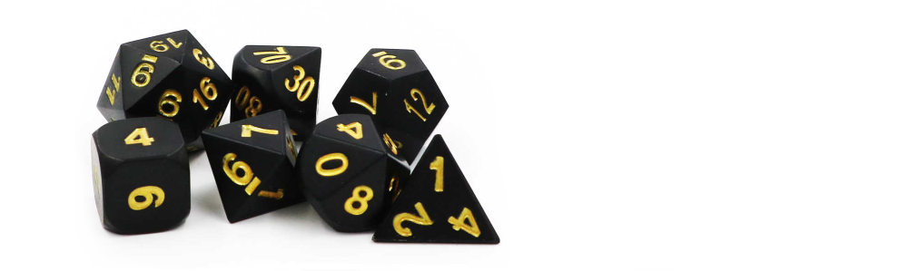

# Кубики для DnD [review]

Вы уже знакомы с типами `Writer`, `Reader` и `State` из модуля `Control.Monad`.

Помимо этих монад, в модуле [Control.Monad](https://hackage.haskell.org/package/base-4.15.0.0/docs/Control-Monad.html) собраны разные монадные аналоги привычных нам функций: `msum`, `filterM`, `zipWithM`, `foldM`, `replicateM` и т.д. Например, так будет выглядеть функция `filterM`:

```hs
-- Prelude
filter  ::                  (a ->   Bool) -> [a] ->   [a]
-- Control.Monad
filterM :: Applicative m => (a -> m Bool) -> [a] -> m [a]
```

С помощью функций из `Control.Monad` решите следующую задачу.

Для игры в [DnD](https://ru.wikipedia.org/wiki/Dungeons_%26_Dragons) требуется набор из `n` игральных костей. Каждая игральная кость — многогранник с числом граней `k`, на которых нанесены натуральные числа от `1` до `k`. Стандартное обозначение кубика с `k` гранями — `dk`, где `3 ≤ k ≤ 20`.

<p float="left">

</p>

Пусть задан некоторый набор игральных костей (задать его можно, указав количество костей и граней каждой кости из набора). Требуется построить распределение вероятностей суммы чисел, выпадающей при бросании этого набор.

Например, несложно посчитать, что при бросании двух `d6`:
- `7` выпадает с вероятностью `6/36`
- `6` и `8` — с вероятностью `5/36`
- `5` и `9` — с вероятностью `4/36`
- `4` и `10` — с вероятностью `3/36`
- `3` и `11` — с вероятностью `2/36`
- `2` и `12` — с вероятностью `1/36`.

Однако, для произвольного набора кубиков теоретическое вычисление распределения несложно, но крайне нудно.

Давайте найдем его приближённо методом [Монте-Карло](https://ru.wikipedia.org/wiki/%D0%9C%D0%B5%D1%82%D0%BE%D0%B4_%D0%9C%D0%BE%D0%BD%D1%82%D0%B5-%D0%9A%D0%B0%D1%80%D0%BB%D0%BE): некоторое, достаточно больше количество раз кинем заданный набор кубиков и посчитаем частоты выпадения различных сумм в таком эксперименте.

Напишите функцию `buildDiceStat :: [Int] -> Int -> IO [(Int,Double)]`, которая будет проводить такое моделирование:
- первый аргумент этой функции — список количества граней костей в наборе
- второй — количество бросаний, которые нужно выполнить
- результат — список пар `(сумма, частота)` для каждого возможного значения суммы,
- где *частота* — доля соответствующих результатов (число от `0` до `1`).

Например, примерно такой список должен вернуть следующий вызов:

```hs
> buildDiceStat [6,6] 1000000
[(2,2.7668e-2),(3,5.5575e-2),(4,8.357e-2),(5,0.111151),(6,0.138808), (7,0.166426),(8,0.139271),(9,0.111063),(10,8.3038e-2),(11,5.564e-2),(12,2.779e-2)]
```

В это задаче запрещается использовать рекурсию. Вместо этого используйте функции из модуля `Control.Monad`.

Для вашего удобства во вспомогательном модуле `DiceUtils` определена функция `drawHist :: Int -> [(Int,Double)] -> IO ()`, выводящая гистограмму для заданного набора частот (передаваемого вторым аргументом). Первый аргумент функции — количество звездочек для масштабирования самой высокой частоты. Например,

```hs
  > buildDiceStat [6,6] 1000000 >>= (drawHist 50)
  2 -  2.77% |********
  3 -  5.55% |*****************
  4 -  8.33% |*************************
  5 - 11.07% |*********************************
  6 - 13.95% |******************************************
  7 - 16.64% |**************************************************
  8 - 13.89% |******************************************
  9 - 11.15% |*********************************
10 -  8.32% |*************************
11 -  5.57% |*****************
12 -  2.76% |********
```

Поскольку используется датчик случайных чисел, то на ваших запусках результаты могут несколько отличаться.

**Важно!**

Если программа не проходит тестирование с диагностикой `Программа завершилась с ошибкой`, то ей, скорее всего, не хватает памяти. Нужно рассмотреть использование энергичных вычислений.


Все тесты пройдены, решение ожидает код-ревью:
```hs
module DiceStat where

import Control.Monad (replicateM)
import System.Random (randomRIO)
import Data.Map (Map)
import qualified Data.Map as Map
import Data.List (sortOn)

-- Функция для броска одной кости с k гранями
rollDie :: Int -> IO Int
rollDie k = randomRIO (1, k)

-- Функция для броска набора костей
rollDice :: [Int] -> IO Int
rollDice dice = sum <$> mapM rollDie dice

-- Функция для построения статистики
buildDiceStat :: [Int] -> Int -> IO [(Int, Double)]
buildDiceStat dice n = do
    results <- replicateM n (rollDice dice)
    let total = fromIntegral n
        freqMap = foldr (\x -> Map.insertWith (+) x 1) Map.empty results
        frequencies = Map.toList $ Map.map (/ total) freqMap
    return $ sortOn fst frequencies
```

Вы можете скачать [тесты для локального запуска](DiceStat.zip).
