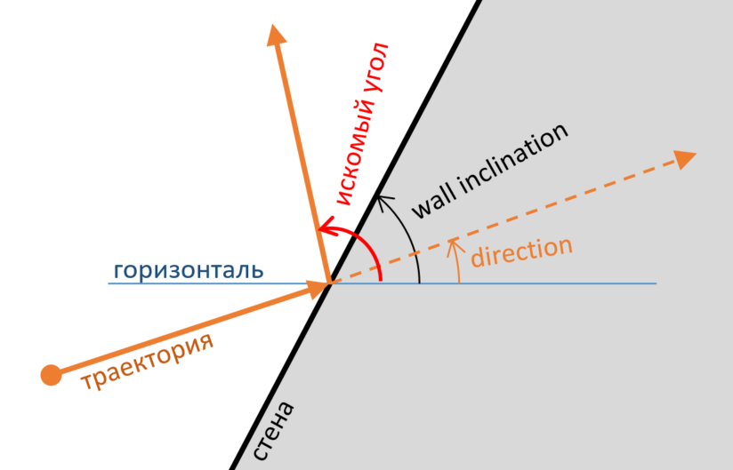

# Практика «Бильярд»

Скачайте [архив с проектом Billard](Billiards.zip).

Реализуйте метод для расчета угла отскока шарика от стены. Считайте, что угол падения равен углу отражения, то есть можно пренебречь всеми физическими эффектами, связанными с кручением шаров, трением шара об стенку и т.п.

Смысл всех, используемых в задаче углов проиллюстрирован на схеме:

<p float="left">

</p>

Проверить корректность вашей реализации можно запустив проект.

Вы можете изучить устройство проекта — это будет полезно, но для выполнения этого задания это совсем не обязательно. Более того, будьте готовы к тому, что в проекте активно используются ещё не пройденные темы.

Все тесты пройдены, задача сдана:
```cs
using System;

namespace Billiards
{
    public static class BilliardsTask
    {
        public static double BounceWall(double directionRadians, double wallInclinationRadians)
		{ return 2*wallInclinationRadians - directionRadians; }
    }
}
```
