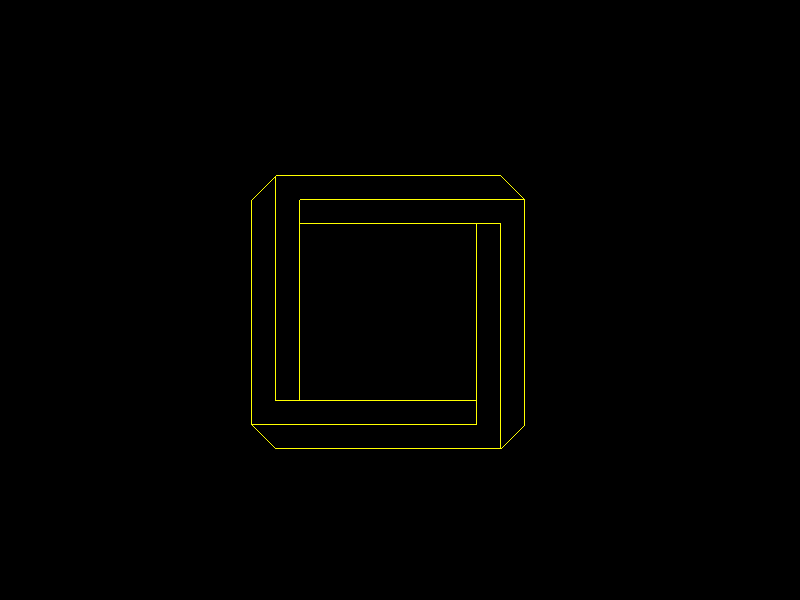

# Практика «Рефакторинг»

Скачайте [архив с проектом Risovatel](Risovatel.zip). Работайте в файле `DrawingProgram.cs`.

Ваша задача привести код в этом файле в порядок. Для начала запустите эту программу. Должно появиться окно с изображением невозможного квадрата.

<p float="left">

</p>

Задание
1. Переименуйте всё, что называется неправильно. Это можно делать двойным нажатием комбинации клавиш Ctrl+R (работает для `VS` и `Rider`).
2. Исправьте форматирование кода. Частично с этим поможет комбинация клавиш: Ctrl+K, Ctrl+D для `VS`, Ctrl+Alt+L для `Rider`, Ctrl+Alt+Enter для `Rider`, использующий схему клавиш `VS`.
3. Повторяющиеся части кода вынесите во вспомогательные методы. Это можно сделать, выделив несколько строк кода и нажав: Ctrl+R, Ctrl+M для `VS`, Ctrl+Alt+M для `Rider`.
4. Избавьтесь от всех зашитых в коде числовых констант — положите их в переменные с понятными именами.

После того как вы закончите, Ulearn bot не должен выдавать ни одного замечания.

Для поиска ошибок можете опираться на [гайд по оформлению кода на C#](https://docs.google.com/document/d/1GZX3_0Cq3RI2GmhvisUsB5l1QR6MDPIMqAlONgnG_2c/edit#). Старайтесь проверять работоспособность программы после значительных изменений, чтобы убедиться, что все работает.

Все тесты пройдены, задача сдана:
```cs
using System;
using Avalonia.Media;
using RefactorMe.Common;

namespace RefactorMe
{
    class Drawing
    {
        static float x, y;
        static IGraphics graphic;

        public static void Initialize(IGraphics newGraphic)
        {
            graphic = newGraphic;
            graphic.Clear(Colors.Black);
        }

        public static void SetPosition(float x0, float y0) { x = x0; y = y0; }

        public static void MakeIt(Pen line, double lenth, double angle)
        {
            var x1 = (float)(x + lenth * Math.Cos(angle));
            var y1 = (float)(y + lenth * Math.Sin(angle));
            graphic.DrawLine(line, x, y, x1, y1);
            x = x1;
            y = y1;
        }

        public static void Change(double lenth, double angle)
        {
            x = (float)(x + lenth * Math.Cos(angle));
            y = (float)(y + lenth * Math.Sin(angle));
        }

        public static void DrawLine(Pen line, double lenth, double angle)
        {
            Drawing.MakeIt(line, lenth * 0.375f, angle);
            Drawing.MakeIt(line, lenth * 0.04f * Math.Sqrt(2), angle + Math.PI / 4);
            Drawing.MakeIt(line, lenth * 0.375f, angle + Math.PI);
            Drawing.MakeIt(line, lenth * 0.375f - lenth * 0.04f, angle + Math.PI / 2);
            Drawing.Change(lenth * 0.04f, angle - Math.PI);
            Drawing.Change(lenth * 0.04f * Math.Sqrt(2), angle + 3 * Math.PI / 4);
        }
    }

    public class ImpossibleSquare
    {
        public static void Draw(int width, int height, double angle, IGraphics graphic)
        {
            Drawing.Initialize(graphic);
            var sz = Math.Min(width, height);
            var diagonal_length = Math.Sqrt(2) * (sz * 0.375f + sz * 0.04f) / 2;
            var x0 = (float)(diagonal_length * Math.Cos(Math.PI / 4 + Math.PI)) + width / 2f;
            var y0 = (float)(diagonal_length * Math.Sin(Math.PI / 4 + Math.PI)) + height / 2f;
			var colorLine = new Pen(Brushes.Yellow);
			Drawing.SetPosition(x0, y0);
            //Рисуем 1-ую сторону
            Drawing.DrawLine(colorLine, sz, 0);
            //Рисуем 2-ую сторону
            Drawing.DrawLine(colorLine, sz, -Math.PI / 2);
            //Рисуем 3-ю сторону
            Drawing.DrawLine(colorLine, sz, Math.PI);
            //Рисуем 4-ую сторону
            Drawing.DrawLine(colorLine, sz, Math.PI / 2);
        }
    }
}
```