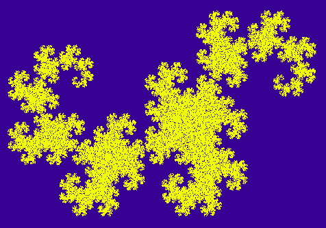

# Практика «Dragon curve»

[Скачайте проект DragonFractal](Fractals.zip).

В этой задаче вам нужно будет нарисовать вот такую фигуру:

<p float="left">

</p>

Вряд ли это пригодится вам в будущем, но зато красиво! :)

Подробнее про этот фрактал можете почитать, например, [в википедии](https://en.wikipedia.org/wiki/Dragon_curve).

Алгоритм построения фрактала читайте в комментариях в классе DragonFractalTask

Кстати, похожим образом можно построить ещё множество фракталов, в частности, [фрактальный папоротник](https://en.wikipedia.org/wiki/Barnsley_fern):

**Как генерировать случайные числа?**

Для этого в пространстве имен System есть класс Random. Работать с ним нужно так:
```cs
// 1. Создание нового генератора последовательности случайных чисел:
var random = new Random(seed);
// seed — число полностью определяющее все последовательность псевдослучайных чисел этого генератора.

// 2. Получение очередного псевдослучайного числа от 0 до 9:
var nextNumber = random.Next(10);
```

Если при инициализации генератора случайных чисел не указывать seed, то используется текущее время компьютера с точностью до миллисекунд. Поэтому если вы создадите два генератора подряд, то с большой вероятностью они проинициализируются одинаково и будут выдавать одну и ту же последовательность.

Типичная ошибка начинающих — поместить обе операции внутрь цикла, тогда как правильно вынести создание генератора за пределы цикла, оставив внутри только получение следующего числа.

Все тесты пройдены, задача сдана:
```cs
using System;
using System.Drawing;

namespace Fractals
{
    internal static class DragonFractalTask
    {
        public static void DrawDragonFractal(Pixels pixels, int iterationsCount, int seed)
        {
            var random = new Random(seed);
            double x = 1;
            double y = 0;
            double xTemp = x;
            double yTemp = y;
            pixels.SetPixel(x, y);
    
            for (int i = 0; i < iterationsCount; i++)
            {
                bool even = random.Next() % 2 == 0;
                x = GetX(xTemp, yTemp, even);
                y = GetY(xTemp, yTemp, even);
                xTemp = x;
                yTemp = y;
                pixels.SetPixel(x, y);
            }
        }
        
        public static double GetX(double x, double y, bool even)
        {
            if (even) return (double)(x * Math.Cos(Math.PI / 4) -
                                      y * Math.Sin(Math.PI / 4)) /
                                      Math.Sqrt(2);
            else return (double) (x * Math.Cos(Math.PI - Math.PI / 4) -
                                  y * Math.Sin(Math.PI - Math.PI / 4)) /
                                  Math.Sqrt(2) + 1;
        }
    
        public static double GetY(double x, double y, bool even)
        {
            if (even) return (double)(x * Math.Sin(Math.PI / 4) +
                                      y * Math.Cos(Math.PI / 4)) /
                                      Math.Sqrt(2);
            else return (double)(x * Math.Sin(Math.PI - Math.PI / 4) +
                                 y * Math.Cos(Math.PI - Math.PI / 4)) /
                                 Math.Sqrt(2);
        }
    }
}
```
