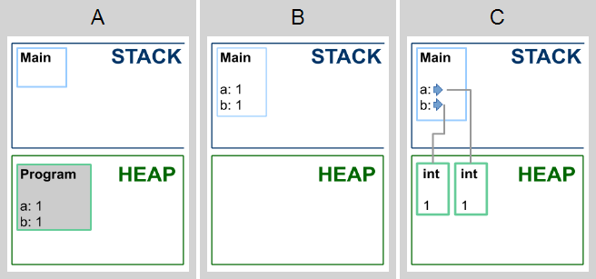
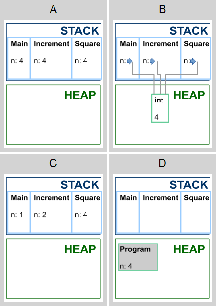
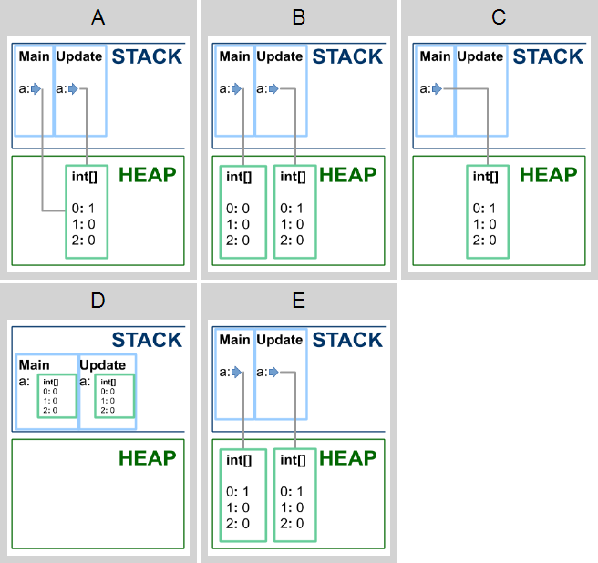
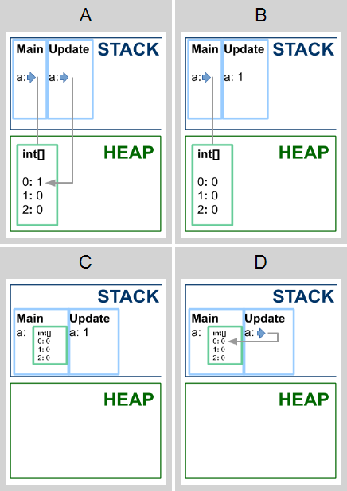
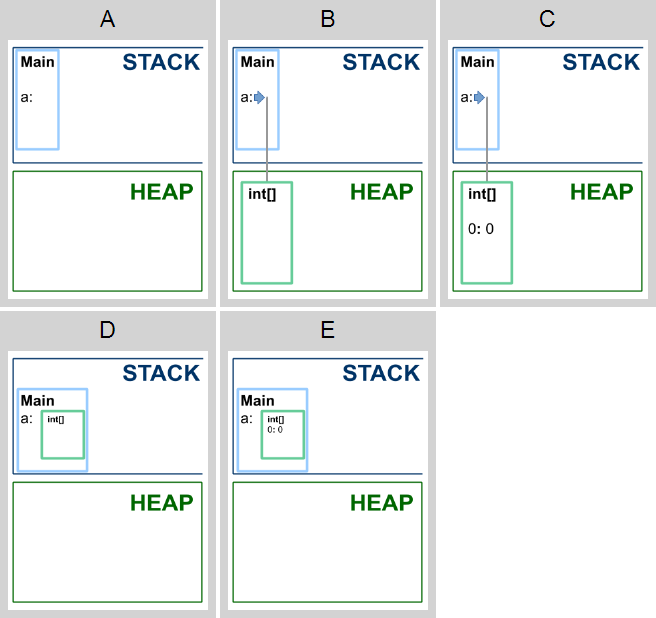
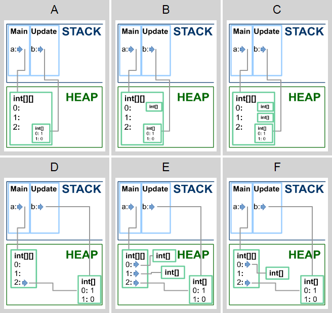

# Карты памяти

В этих заданиях вам нужно изучить код и сопоставить ему одну из предложенных карт памяти.

**Какая из карт памяти соответствует коду к моменту выхода из метода Main?**

```cs
public class Program
{
    public static void Main()
    {
        int a = 1; 
        int b = 1;
        // ?
    }
}
```

<p float="left">

</p>

1. Выберите подходящую карту памяти (1 из 1 балла)
   * 🔴 **A**
   * 🟢 **B** (Правильно! Локальные переменные выделяются на стеке.)
   * 🔴 **C**
   
**Какая из карт памяти соответствует коду к моменту выхода из метода Square?**

```cs
class Program
{
    static void Square(int n)
    {
        n *= n;
        // ?
    }

    static void Increment(int n)
    {
        n++;
        Square(n);
    }

    static void Main()
    {
        int n = 1;
        Increment(n);
    }
}
```

<p float="left">

</p>

2. Выберите подходящую карту памяти (1 из 1 балла)
   * 🔴 **A**
   * 🔴 **B**
   * 🟢 **C** (Правильно! Локальные переменные и параметры методов выделяются на стеке.)
   * 🔴 **D**

**Какая из карт памяти соответствует коду к моменту выхода из метода Update?**

```cs
public class Program
{
    static void Update(int[] a)
    {
        a = new int[3];
        a[0]++;
        // ?
    }

    static void Main()
    {
        int[] a = new int[3];
        Update(a);
    }
}
```

<p float="left">

</p>

3. Выберите подходящую карту памяти (1 из 1 балла)
   * 🔴 **A**
   * 🟢 **B** (Правильно!)
   * 🔴 **C**
   * 🔴 **D**
   * 🔴 **E**

**Какая из карт памяти соответствует коду к моменту выхода из метода Update?**

```cs
public class Program
{
    static void Update(int a)
    {
        a++;
        // ?
    }

    static void Main()
    {
        int[] a = new int[3];
        Update(a[0]);
    }
}
```

<p float="left">

</p>

4. Выберите подходящую карту памяти (1 из 1 балла)
   * 🔴 **A**
   * 🟢 **B** (Правильно!)
   * 🔴 **C**
   * 🔴 **D**

**Какая из карт памяти соответствует коду к моменту выхода из метода Main?**

```cs
public class Program
{
    static void Main()
    {
        int[] a = new int[0];
        // ?
    }
}
```

<p float="left">

</p>

5. Выберите подходящую карту памяти (1 из 1 балла)
   * 🔴 **A**
   * 🟢 **B** (Правильно!)
   * 🔴 **C**
   * 🔴 **D**
   * 🔴 **E**

**Какая из карт памяти соответствует коду к моменту выхода из метода Update?**

```cs
public class Program
{
    static void Update(int[] b)
    {
        b[0]++;
        // ?
    }

    static void Main()
    {
        var a = new int[3][];
        a[0] = new int[0];
        a[2] = new int[2];
        Update(a[2]);
    }
}
```

<p float="left">

</p>

6. Выберите подходящую карту памяти (1 из 1 балла)
   * 🔴 **A**
   * 🔴 **B**
   * 🔴 **C**
   * 🔴 **D**
   * 🔴 **E**
   * 🟢 **F** (Правильно!)
