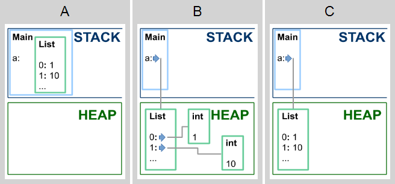
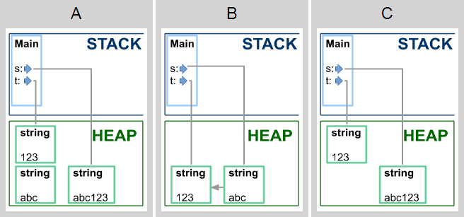
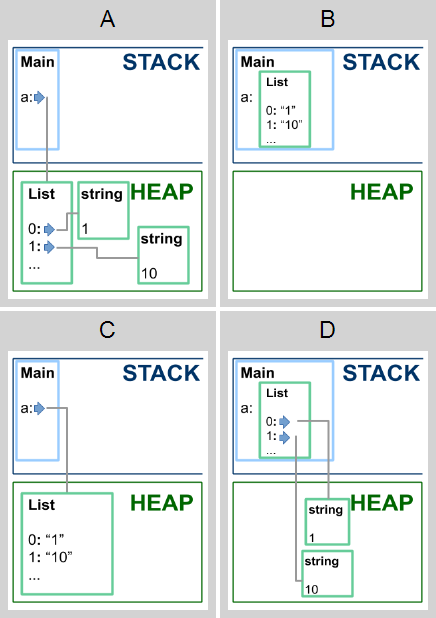

# Карты памяти

В этих заданиях вам нужно изучить код и сопоставить ему одну из предложенных карт памяти.

**Какая из карт памяти соответствует коду к моменту выхода из метода Main?**

```cs
public class Program
{
    static void Main()
    {
        var a = new List<int>();
        a.Add(1);
        a.Add(10);
        // ?
    }
}
```

<p float="left">

</p>

1. Выберите подходящую карту памяти (1 из 1 балла)
   * 🔴 **A**
   * 🔴 **B**
   * 🟢 **C** (Правильно!)
   
**Какая из карт памяти соответствует коду к моменту выхода из метода Main? Считайте, что сборщик мусора ещё не запускался.**

```cs
class Program
{
    static void Main()
    {
        string s = "abc";
        string t = "123";
        s += t;
        // ?
    }
}
```

<p float="left">

</p>

2. Выберите подходящую карту памяти (1 из 1 балла)
   * 🟢 **A** (Правильно!)
   * 🔴 **B**
   * 🔴 **C**
   * 🔴 **D**

**Какая из карт памяти соответствует коду к моменту выхода из метода Main?**

```cs
public class Program
{
    static void Main()
    {
        var a = new List<string>();
        a.Add("1");
        a.Add("10");
        // ?
    }
}
```

<p float="left">

</p>

3. Выберите подходящую карту памяти (1 из 1 балла)
   * 🟢 **A** (Правильно!)
   * 🔴 **B**
   * 🔴 **C**
   * 🔴 **D**
   * 🔴 **E**
