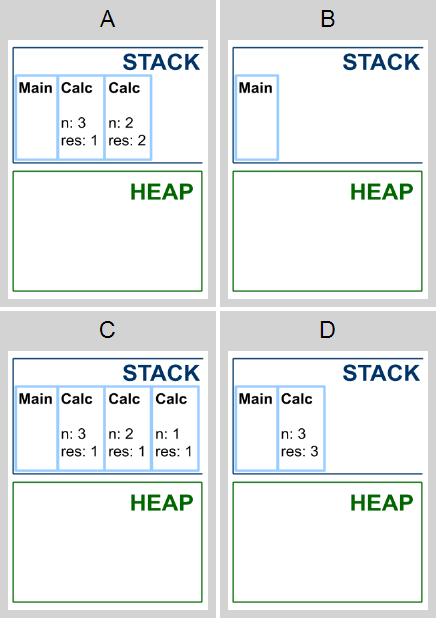
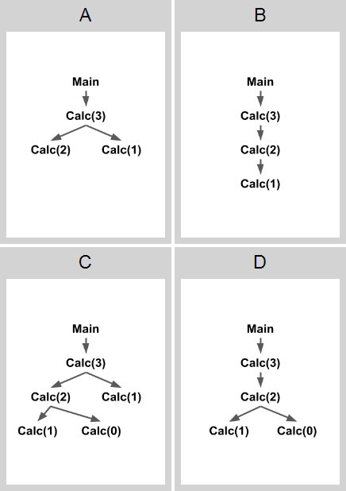
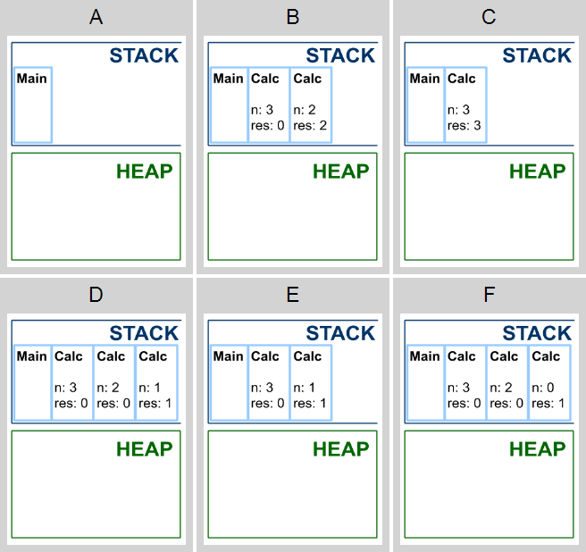

# Понимание рекурсии

```cs
static int F(int x)
{
   if (x % 10 == 0) return 0;
   return 1 + F(x / 10);
}
```

1. Что делает функция ***F***? (1 из 1 балла)
   * 🟢 **Вычисляет минимальный разряд десятичного числа ***x***, в котором стоит 0** (Правильно!)
   * 🔴 **Вычисляет НОД ***x*** и ***y*** по алгоритму Евклида**
   * 🔴 **Вычисляет остаток от деления ***x*** на ***y*****
   * 🔴 **Вычисляет значение x^y**
   * 🔴 **При некоторых значениях аргументов будет бесконечная рекурсия**
   

2. Легко проверить, что вызов ***F(0)*** не породит ни одного рекурсивного вызова ***F***. А сколько рекурсивных вызовов ***F*** породит вызов ***F(15)***? (1 из 1 балла)
   * 🟢 `2` (Правильный ответ: 2)<br>
   (первый рекурсивный вызов — ***F(1)***, второй — ***F(0)***)


```cs
static int G(int x, int y)
{
   if (y == 0)
       return x;
   else
       return G(y, x % y);
}
```

3. Что делает функция ***G***?  (1 из 1 балла)
   * 🟢 **Вычисляет НОД ***x*** и ***y*** по алгоритму Евклида** (Правильно! это рекурсивная версия классического алгоритма Евклида)
   * 🔴 **При некоторых значениях аргументов будет бесконечная рекурсия**
   * 🔴 **Вычисляет остаток от деления ***x*** на ***y*****
   * 🔴 **Вычисляет минимальный разряд десятичного числа ***x***, в котором стоит ***0*****
   * 🔴 **Вычисляет значение x^y**


Расположите карты памяти в порядке, который соответствует порядку выходов из методов.

```cs
public class Program
{
    static int Calc(int n)
    {
        int res = 1;
        if (n > 1)
            res = 1 + Calc(n - 1);
        return res;
    }

    public static void Main()
    {
        Console.WriteLine(Calc(3));
    }
}
```

<p float="left">

</p>

4. Расположите карты памяти в том порядке, в который соответствует выходам из рекурсивного метода Calc. (1 из 1 балла)

| ✅ |
|-|
| C |
| A |
| D |
| B |


Расположите карты памяти в порядке, который соответствует порядку выходов из методов.

```cs
public class Program
{
    static int Calc(int n)
    {
        int res = 1;
        if (n > 1)
            res = Calc(n - 1) + Calc(n - 2);
        return res;
    }

    public static void Main()
    {
        Console.WriteLine(Calc(2));
    }
}
```

<p float="left">

</p>

5. Расположите карты памяти в том порядке, в который соответствует выходам из рекурсивного метода Calc. (1 из 1 балла)

| ✅ |
|---|
| D |
| A |
| C |
| B |


Постройте дерево рекурсии для приведенного кода.

```cs
public class Program
{
    static int Calc(int n)
    {
        int res = 1;
        if (n > 1)
            res = Calc(n - 1) + Calc(n - 2);
        return res;
    }

    public static void Main()
    {
        Console.WriteLine(Calc(3));
    }
}
```

<p float="left">

</p>

6. Выберите подходящее дерево. (1 из 1 балла)
   * 🔴 **A**
   * 🔴 **B**
   * 🟢 **C** (Правильно!)
   * 🔴 **D**


Расположите карты памяти в порядке, который соответствует порядку выходов из методов.

```cs
public class Program
{
    static int Calc(int n)
    {
        int res = 1;
        if (n > 1)
            res = Calc(n - 1) + Calc(n - 2);
        return res;
    }

    public static void Main()
    {
        Console.WriteLine(Calc(3));
    }
}
```

<p float="left">

</p>

7. Расположите карты памяти в том порядке, в который соответствует выходам из рекурсивного метода Calc. (1 из 1 балла)

| ✅ |
|---|
| D |
| F |
| B |
| E |
| C |
| A |
