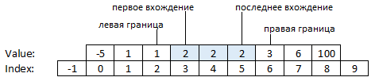

# Рекурсивный бинарный поиск

Часто нам нужно чуть больше, чем просто найти любой совпадающий элемент, либо сказать, что его нет. В разных условиях пригождаются разные модификации бинарного поиска. Всего есть четыре модификации:
- Найти индекс последнего элемента меньшего заданному или -1, если такого нет (левая граница)
- Найти индекс первого элемента равного заданному или -1, если такого нет (первое вхождение)
- Найти индекс последнего элемента равного заданному или -1, если такого нет (последнее вхождение)
- Найти индекс первого элемента большего заданного или N, если такого нет (правая граница)

<p float="left">

</p>

Левая и правая границы чуть менее понятны, однако через них можно легко выражаются остальные две модификации и ещё несколько важных подзадач.

Левую и правую границы можно себе представлять как указания, куда в массиве нужно вставить искомый элемент, чтобы не нарушить сортировку. А именно, чтобы не нарушить сортировку вставлять новый элемент можно в любое место строго правее левой границей и нестрого левее правой границы.

При поиске границ удобно считать, что левая граница может принимать значение -1, если уже нулевой элемент больше или равен заданному (это означает, что вставлять искомый элемент нужно в самое начало массива). А правая граница может принимать значение `array.Length`, если последний элемент меньше или равен заданному (а это означает, что вставлять элемент нужно в самый конец).

Естественно, тогда и начинать бинарный поиск нужно с `left=-1` и `right=array.Length`.

Вот несколько примеров, помогающих лучше понять идеи левой и правой границ:

| **массив** | **значение** | **левая граница** | **правая граница** |
|------------|--------------|-------------------|--------------------|
| [2 4 4 6]  | 1            | -1                | 0                  |
| [2 4 4 6]  | 2            | -1                | 1                  |
| [2 4 4 6]  | 3            | 0                 | 1                  |
| [2 4 4 6]  | 4            | 0                 | 3                  |
| [2 4 4 6]  | 5            | 2                 | 3                  |
| [2 4 4 6]  | 6            | 2                 | 4                  |
| [2 4 4 6]  | 7            | 3                 | 4                  |
| []         | 1            | -1                | 0                  |

Например, с помощью поиска правой и левой границы можно вычислить количество элементов в массиве, значения которых лежат в заданном диапазоне [minValue, maxValue]:

count = BinSearchRightBorder(arr, maxValue, -1, arr.Length) - BinSearchLeftBorder(arr, minValue, -1, arr.Length) - 1;

В этой задаче вам нужно дописать рекурсивную версию бинарного поиска, который находит левую границу, то есть индекс максимального элемента меньшего value или -1, если такого элемента нет

```cs
private static int FindLeftBorder(long[] arr, long value)
{
	return BinSearchLeftBorder(arr, value, -1, arr.Length);
}
```


Все тесты пройдены, задача сдана:
```cs
public static int BinSearchLeftBorder(long[] array, long value, int left, int right)
{
    if (left + 1 >= right) return left;
    var m = (left + right) / 2;
    if (array[m] < value) return BinSearchLeftBorder(array, value, m, right);
    return BinSearchLeftBorder(array, value, left, m);
}
```
