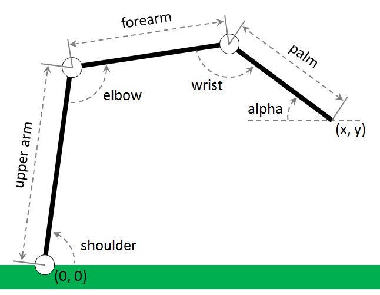

# Практика «Манипулятор»

[Скачайте проект](manipulator.zip).

В этой серии задач, вы будете программировать роботизированный манипулятор.

Изучите его чертёж.

<p float="left">

</p>

В первой задаче вам нужно по величине углов shoulder, elbow и wrist вычислить координаты соответствующих суставов.

Для этого в классе AnglesToCoordinatesTask реализуйте метод `Point[] GetJointPositions(double shoulder, double elbow, double wrist)`

В том же файле в классе AnglesToCoordinatesTask_Tests напишите модульные тесты, покрывающие все принципиальные случаи.

Используйте константы UpperArm, Forearm и Palm из класса Manipulator в качестве размеров соответствующих частей манипулятора.

После выполнения этого задания, при запуске проекта, визуализация должна будет отражать положение манипулятора в зависимости от начальных значений.

Все тесты пройдены, задача сдана:
```cs
using System;
using Avalonia;
using NUnit.Framework;
using static Manipulation.Manipulator;

namespace Manipulation
{
    public static class AnglesToCoordinatesTask
    {
        public static Point[] GetJointPositions(double shoulder, double elbow, double wrist)
        {
            var cosShoulder = (float)Math.Cos(shoulder);
            var sinShoulder = (float)Math.Sin(shoulder);
        
            var cosElbow = (float)Math.Cos(elbow + Math.PI + shoulder);
            var sinElbow = (float)Math.Sin(elbow + Math.PI + shoulder);
        
            var cosWrist = (float)Math.Cos(shoulder + Math.PI + elbow + Math.PI + wrist);
            var sinWrist = (float)Math.Sin(shoulder + Math.PI + elbow + Math.PI + wrist);
        
            var elbowPos = new Point(UpperArm * cosShoulder, UpperArm * sinShoulder);
            var wristPos = new Point(elbowPos.X + (Forearm * cosElbow), elbowPos.Y + (Forearm * sinElbow));
            var palmEndPos = new Point(wristPos.X + (Palm * cosWrist), wristPos.Y + (Palm * sinWrist));
            
            return new Point[] { elbowPos, wristPos, palmEndPos };
        }
    }
    
    [TestFixture]
    public class AnglesToCoordinatesTask_Tests
    {
        [TestCase(Math.PI / 2, Math.PI / 2, Math.PI, Manipulator.Forearm + Manipulator.Palm, Manipulator.UpperArm)]
        [TestCase(0, Math.PI, Math.PI, Manipulator.UpperArm + Manipulator.Forearm + Manipulator.Palm, 0)]
        [TestCase(Math.PI, Math.PI, Math.PI, -Manipulator.Forearm - Manipulator.Palm - Manipulator.UpperArm, 0)]
        [TestCase(0, 3 * Math.PI / 2, 3 * Math.PI / 2, Manipulator.UpperArm - Manipulator.Palm, Manipulator.Forearm)]
    
        public void TestGetJointPositions(double shoulder, double elbow, double wrist, double palmEndX, double palmEndY)
        {
            var joints = AnglesToCoordinatesTask.GetJointPositions(shoulder, elbow, wrist);
            Assert.AreEqual(palmEndX, joints[2].X, 1e-5, "palm endX");
            Assert.AreEqual(palmEndY, joints[2].Y, 1e-5, "palm endY");
        }
    }
}
```
