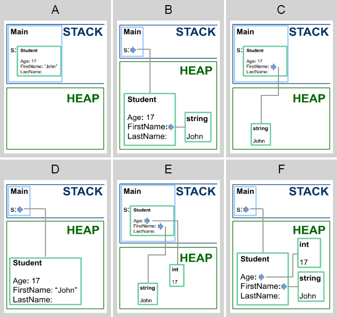
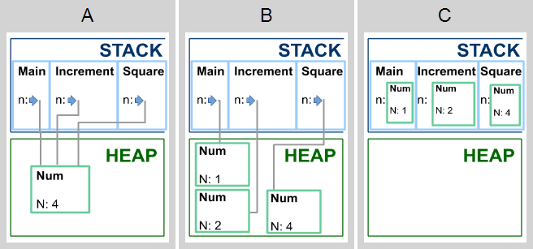
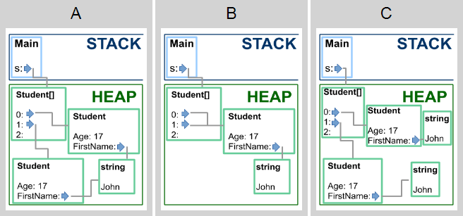
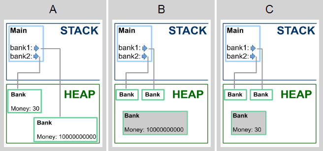
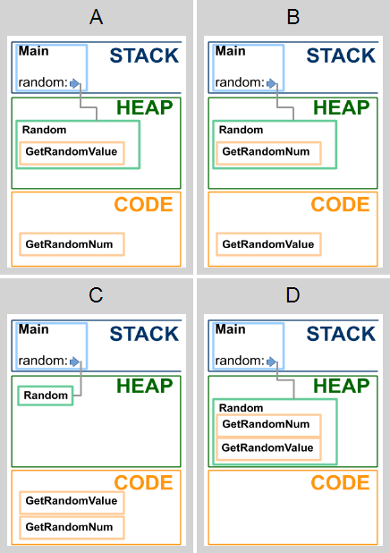
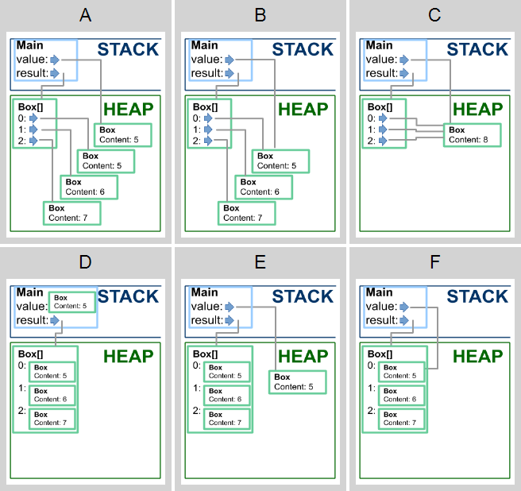

# Карты памяти

В этих заданиях вам нужно изучить код и сопоставить ему одну из предложенных карт памяти.

**Какая из карт памяти соответствует коду к моменту выхода из метода Main?**

```cs
class Student
{
    public int Age;
    public string FirstName;
    public string LastName;
}

class Program
{
    static void Main()
    {
        Student s = new Student     
        {
            Age = 17, 
            FirstName = "John" 
        };
        // ?
    }
}
```

<p float="left">

</p>

1. Выберите подходящую карту памяти (1 из 1 балла)
   * 🔴 **A**
   * 🟢 **B** (Правильно!)
   * 🔴 **C**
   * 🔴 **D**
   * 🔴 **E**
   * 🔴 **F**
   

**Какая из карт памяти соответствует коду к моменту выхода из метода Square?**

```cs
class Num
{
    public int N;
}

class Program
{
    static void Square(Num n)
    {
        n.N *= n.N;
        // ?
    }

    static void Increment(Num n)
    {
        n.N++;
        Square(n);
    }

    static void Main()
    {
        Num n = new Num
        {
            N = 1
        };
        Increment(n);
    }
}
```

<p float="left">

</p>

2. Выберите подходящую карту памяти (1 из 1 балла)
   * 🟢 **A** (Правильно!)
   * 🔴 **B**
   * 🔴 **C**


**Какая из карт памяти соответствует коду к моменту выхода из метода Main?**

```cs
class Student
{
    public int Age;
    public string FirstName;
}

class Program
{
    static void Main()
    {
        var s = new Student[3]; 
        s[0] = new Student     
        {
            Age = 17, 
            FirstName = "John" 
        };
        s[1] = s[0];
        // ?
    }
}
```

<p float="left">

</p>

3. Выберите подходящую карту памяти (1 из 1 балла)
   * 🔴 **A**
   * 🟢 **B** (Правильно!)
   * 🔴 **C**


**Какая из карт памяти соответствует коду к моменту выхода из метода Main?**

```cs
class Bank
{
    public static long Money;

    public void SetMoney(long x)
    {
        Money = x;
    }
}

class Program
{
    static void Main()
    {
        var bank1 = new Bank();
        var bank2 = new Bank();
        bank1.SetMoney(10000000000);
        bank2.SetMoney(30);
        // ?
    }
}
```

<p float="left">

</p>

4. Выберите подходящую карту памяти (1 из 1 балла)
   * 🔴 **A**
   * 🔴 **B**
   * 🟢 **C** (Правильно!)


**Какая из карт памяти соответствует коду к моменту выхода из метода Main?**

```cs
class Random
{
    public int GetRandomValue()
    {
        return 4; // obtained by a fair dice roll
    }

    public static int GetRandomNum()
    {
        return 4;
    }
}

class Program
{
    public static void Main()
    {
        Random random = new Random();
        // ?
    }
}
```

<p float="left">

</p>

5. Выберите подходящую карту памяти (1 из 1 балла)
   * 🔴 **A**
   * 🔴 **B**
   * 🟢 **C** (Правильно!)
   * 🔴 **D**


**Какая из карт памяти соответствует коду к моменту выхода из метода Main?**

```cs
class Box
{
    public int Content;
}

public class Program
{
    static void Main()
    {
        var value = new Box { Content = 5 };
        var result = new Box[3];
        for (int i = 0; i < result.Length; i++)
        {
            result[i] = value;
            value.Content++;
        }
        // ?
    }
}
```

<p float="left">

</p>

6. Выберите подходящую карту памяти (1 из 1 балла)
   * 🔴 **A**
   * 🔴 **B**
   * 🟢 **C** (Правильно!)
   * 🔴 **D**
   * 🔴 **E**
   * 🔴 **F**
