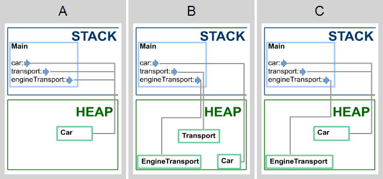

# Касты

Изучите следующий код:

```cs
class ClassA { }

class ClassB : ClassA { }

class ClassC : ClassA { }

class Program 
{
    public static void Main()
    {
        ClassA a = new ClassA();
        ClassB b = new ClassB();
        ClassC c = new ClassC();
        ClassA d = (ClassA) b;
    }
}
```

1. Конверсия переменной b к ClassA — это... (1 из 1 балла)
   * 🟢 **Upcast** (Правильно! b — это объект ClassB, который наследует ClassA — каст идет вверх по иерархии наследования)
   * 🔴 **Downcast**
   * 🔴 **Ни то, ни другое**
   

2. Конверсия переменной c к ClassA... (1 из 1 балла)
   * 🟢 **Пройдет без ошибок** (Правильно! Это upcast, он всегда возможен и проходит без ошибок)
   * 🔴 **Вызовет ошибку компиляции**
   * 🔴 **Вызовет ошибку на этапе выполнения**


3. Конверсия переменной a к ClassB — это (1 из 1 балла)
   * 🔴 **Upcast**
   * 🟢 **Downcast** (Правильно! ClassB — это наследник ClassA, поэтому каст идет по иерархии вниз. Хотя в данном случае этот downcast завершится с ошибкой.)
   * 🔴 **Ни то, ни другое**


4. Конверсия переменной d к ClassC... (1 из 1 балла)
   * 🔴 **Пройдет без ошибок**
   * 🔴 **Вызовет ошибку компиляции**
   * 🟢 **Вызовет ошибку на этапе выполнения** (Правильно! d указывает на тот же объект, что и b, т.е. на объект класса ClassB. Его downcast к ClassC невозможен)


5. К каким типам можно привести переменную d без ошибок? (1 из 1 балла)
   * ✅ **ClassA** (Правильно! Переменная d уже имеет тип ClassA)
   * ✅ **ClassB** (Правильно! Переменная d указывает на объект типа ClassB, downcast возможен)
   * ❌ **ClassC** (Это приведение вызовет ошибку на этапе выполнения, поскольку ClassB (реальный тип значения в d) и ClassC находятся в разных ветвях дерева наследования)


6. Конверсия переменной c к ClassB... (1 из 1 балла)
   * 🔴 **Upcast**
   * 🔴 **Downcast**
   * 🟢 **Ни то, ни другое** (Правильно! Ни один из классов ClassB и ClassC не наследуют другой)


**Какая из карт памяти соответствует коду к моменту выхода из метода Main?**

```cs
class Transport
{
}

class EngineTransport : Transport
{
}

class Car : EngineTransport
{
}

class Program
{
    static void Main()
    {
        var car = new Car();
        var engineTransport = (EngineTransport)car;
        var transport = (Transport)engineTransport;
        engineTransport = new EngineTransport();
    }
}
```

<p float="left">

</p>

7. Выберите подходящую карту памяти (1 из 1 балла)
   * 🔴 **A**
   * 🔴 **B**
   * 🟢 **C** (Правильно!)
