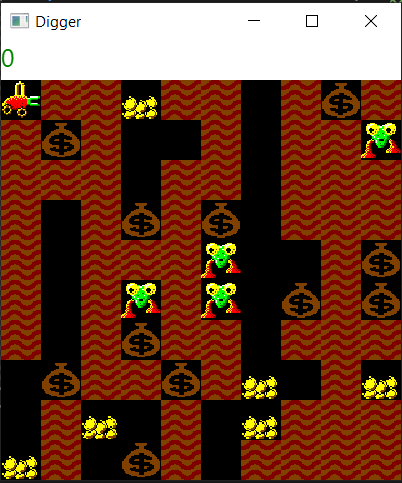

# Практика «Земля и Диггер»

<p float="left">

</p>

Когда-то Digger был одной из самых продвинутых и интересных компьютерных игр. В этом блоке задач мы воссоздадим некоторое её подмножество с помощью ООП.

[Скачайте проект](Digger.zip)

Вам предстоит наполнить готовую заготовку игровыми элементами. Каждый элемент должен уметь:
- Возвращать имя файла, в котором лежит соответствующая ему картинка (например, "Terrain.png")
- Сообщать приоритет отрисовки. Чем выше приоритет, тем раньше рисуется соответствующий элемент, это важно для анимации.
- Действовать — возвращать направление перемещения и, если объект во что-то превращается на следующем ходу, то результат превращения.
- Разрешать столкновения двух элементов в одной клетке.

**Terrain**

Сделайте класс Terrain, реализовав ICreature. Сделайте так, чтобы он ничего не делал.

**Player**

Сделайте класс Player, реализовав ICreature.

Сделайте так, чтобы диггер шагал в разные стороны в зависимости от нажатой клавиши со стрелкой (Game.KeyPressed). Убедитесь, что диггер не покидает пределы игрового поля.

Сделайте так, чтобы земля исчезала в тех местах, где прошел диггер.

Запустите проект — игра должна заработать!

В методе Game.CreateMap вы можете менять карту, на которой будет запускаться игра. Используйте эту возможность для отладки.


Все тесты пройдены, задача сдана:
```cs
using System;
using Avalonia.Input;
using Digger.Architecture;

namespace Digger
{
    public class Terrain : ICreature
    {
        public CreatureCommand Act(int x, int y) { return new CreatureCommand(); }
    
        public bool DeadInConflict(ICreature conflictedObject)
        { return !conflictedObject.ToString().Equals("Digger.png"); }
    
        public int GetDrawingPriority()
        { return 1; }
    
        public string GetImageFileName()
        { return "Terrain.png"; }
    }
    
    public class Player : ICreature
    {
        public CreatureCommand Act(int x, int y)
        {
            var creatureCommand = new CreatureCommand
            {
                DeltaX = x,
                DeltaY = y
            };
    
            if (Game.KeyPressed == Key.Right) creatureCommand.DeltaX++;
            if (Game.KeyPressed == Key.Left) creatureCommand.DeltaX--;
            if (Game.KeyPressed == Key.Up) creatureCommand.DeltaY--;
            if (Game.KeyPressed == Key.Down) creatureCommand.DeltaY++;
    
            if ((creatureCommand.DeltaX < 0) ||
                (creatureCommand.DeltaX >= Game.MapWidth)) creatureCommand.DeltaX = x;
            if ((creatureCommand.DeltaY < 0) ||
                (creatureCommand.DeltaY >= Game.MapHeight)) creatureCommand.DeltaY = y;
    
            creatureCommand.DeltaX -= x;
            creatureCommand.DeltaY -= y;
    
            return creatureCommand;
        }
    
        public bool DeadInConflict(ICreature conflictedObject) { return false; }
    
        public int GetDrawingPriority() { return 1; }
    
        public string GetImageFileName() { return "Digger.png"; }
    }
}
```
