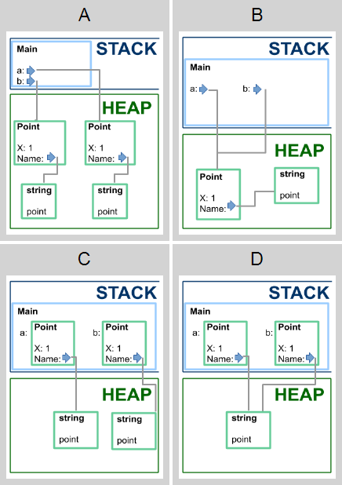
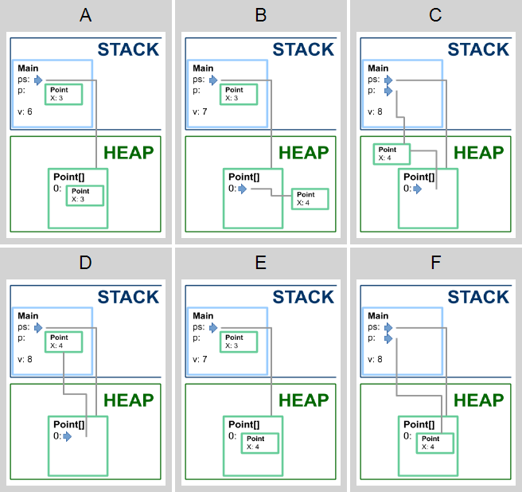
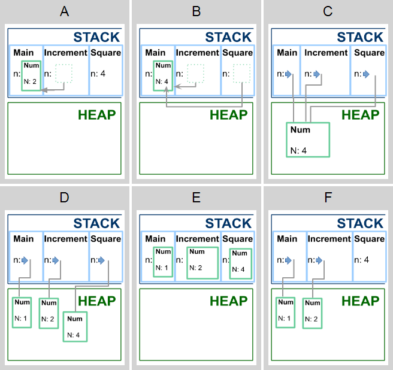
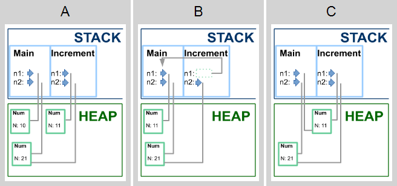
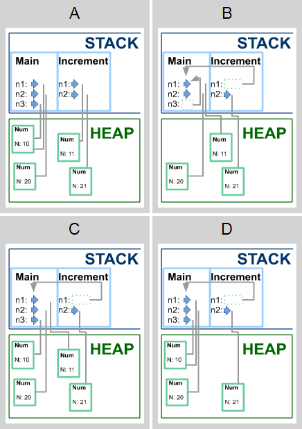

# Карты памяти

В этих заданиях вам нужно изучить код и сопоставить ему одну из предложенных карт памяти.

**Какая из карт памяти соответствует коду к моменту выхода из метода Main?**

```cs
struct Point
{
    public int X;
    public string Name;
}

public class Program
{
    static void Main()
    {
        Point a;
        Point b;
        a.X = 1;
        a.Name = "point";
        b = a;
    }
}
```

<p float="left">

</p>

1. Выберите подходящую карту памяти (1 из 1 балла)
   * 🔴 **A**
   * 🔴 **B**
   * 🔴 **C**
   * 🟢 **D** (Правильно!)
   

**Какая из карт памяти соответствует коду к моменту выхода из метода Square?**

```cs
struct Num
{
    public int N;
}

class Program
{
    static void Square(Num n)
    {
        n.N *= n.N;
        // ?
    }
   
    static void Increment(Num n)
    {
        n.N++;
        Square(n);
    }
   
    static void Main()
    {
        Num n = new Num
        {
            N = 1
        };
        Increment(n);
    }
}
```

<p float="left">

</p>

2. Выберите подходящую карту памяти (1 из 1 балла)
   * 🟢 **A** (Правильно!)
   * 🔴 **B**


**Какая из карт памяти соответствует коду к моменту выхода из метода Main?**

```cs
class Box
{
    public Point Content;
}

struct Point
{
    public double X;
    public double Y;
}

class Program
{
    static void Main()
    {
        var a = new Box
        {
            Content = new Point { X = 1, Y = 2 }
        };
        // ?
    }
}
```

<p float="left">

</p>

3. Выберите подходящую карту памяти (1 из 1 балла)
   * 🔴 **A**
   * 🔴 **B**
   * 🔴 **C**
   * 🟢 **D** (Правильно!)


**Какая из карт памяти соответствует коду к моменту выхода из метода Main?**

```cs
struct Point
{
    public double X;
}

class Program
{
    static void Main()
    {
        var ps = new Point[]
        {
            new Point { X = 3 },
        };
        var p = ps[0];
        Update(ps);
        var v = p.X + ps[0].X;
        // ?
    }
   
    static void Update(Point[] ps)
    {
        ps[0].X++;
    }
}
```

<p float="left">

</p>

4. Выберите подходящую карту памяти (1 из 1 балла)
   * 🔴 **A**
   * 🔴 **B**
   * 🔴 **C**
   * 🔴 **D**
   * 🟢 **E** (Правильно!)
   * 🔴 **F**


**Какая из карт памяти соответствует коду к моменту выхода из метода Square?**

```cs
struct Num
{
    public int N;
}

class Program
{
    static void Square(ref int n)
    {
        n *= n;
        // ?
    }
   
    static void Increment(ref Num n)
    {
        n.N++;
        Square(ref n.N);
    }
   
    static void Main()
    {
        Num n = new Num
        {
            N = 1
        };
        Increment(ref n);
    }
}
```

<p float="left">

</p>

5. Выберите подходящую карту памяти (1 из 1 балла)
   * 🔴 **A**
   * 🟢 **B** (Правильно!)
   * 🔴 **C**
   * 🔴 **D**


**Какая из карт памяти соответствует коду к моменту выхода из метода Increment?**

```cs
class Num
{
    public int N;
}

class Program
{
    static void Increment(ref Num n1, Num n2)
    {
        n1.N++;
        n2.N++;
        // ?
    }
   
    static void Main()
    {
        var n1 = new Num { N = 10 };
        var n2 = new Num { N = 20 };
        Increment(ref n1, n2);
    }
}
```

<p float="left">

</p>

6. Выберите подходящую карту памяти (1 из 1 балла)
   * 🔴 **A**
   * 🟢 **B** (Правильно!)
   * 🔴 **C**


**Какая из карт памяти соответствует коду к моменту выхода из метода Increment?**

```cs
class Num
{
    public int N;
}

class Program
{
    static void Increment(ref Num n1, Num n2)
    {
        n1 = new Num() { N = n1.N + 1 };
        n2 = new Num() { N = n2.N + 1 };
        // ?
    }
   
    static void Main()
    {
        var n1 = new Num { N = 10 };
        var n2 = new Num { N = 20 };
        var n3 = n1;
        Increment(ref n1, n2);
    }
}
```

<p float="left">

</p>

7. Выберите подходящую карту памяти (1 из 1 балла)
   * 🔴 **A**
   * 🔴 **B**
   * 🟢 **C** (Правильно!)
   * 🔴 **D**
