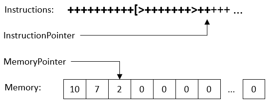

# Практика «Виртуальная машина Brainfuck»

Скачайте проект [brainfuck](brainfuck.zip).

Создавать языки программирования сложно. Но не всегда! Язык программирования [Brainfuck](https://ru.wikipedia.org/wiki/Brainfuck) — это экстремально простой язык программирования, интерпретатор при желании можно уместить на один экран кода. Программа на Brainfuck состоит только из символов +-<>.,[], поэтому читать такие программы не очень удобно. :-)

В этой серии задач вам предстоит создать этот интерпретатор с возможностью его простого расширения новыми операциями.

В задачах программирования интерпретаторов часто оказываются удобными пройденные в этом блоке делегаты анонимные функции — решите эту задачу с помощью анонимных функций.

**Виртуальная машина**

<p float="left">

</p>

Виртуальная машина хранит следующее:
- Массив памяти, каждая ячейка которого хранит 1 байт. По умолчанию размер памяти — 30000 ячеек.
- Указатель на текущую ячейку памяти. Изначально, указатель указывает на нулевую ячейку.
- Выполняемую программу. Она состоит из инструкций, каждая обозначается одним символом. Программа начинает выполняться с первого символа последовательно.
- Номер выполняемой в данный момент инструкции. После выполнения любой инструкции номер увеличивается на единицу. Как только номер инструкции выходит за пределы программы, выполнение заканчивается.

Конкретные операции на языке Brainfuck могут читать или менять эти данные.

В этой части вам нужно реализовать виртуальную машину в классе VirtualMachine.cs так, чтобы проходили все тесты из файла VirtualMachineTests.cs.


Все тесты пройдены, задача сдана:
```cs
using System;
using System.Collections.Generic;

namespace func.brainfuck
{
    public class VirtualMachine : IVirtualMachine
    {
        public string Instructions { get; }
        public int InstructionPointer { get; set; }
        public byte[] Memory { get; }
        public int MemoryPointer { get; set; }
        public Dictionary<char, Action<IVirtualMachine>> Command { get; set; }
    
        public VirtualMachine(string program, int memorySize)
        {
            this.Instructions = program;
            this.Memory = new byte[memorySize];
            this.InstructionPointer = 0;
            Command = new Dictionary<char, Action<IVirtualMachine>> { };
        }
    
        public void RegisterCommand(char symbol, Action<IVirtualMachine> execute)
        { Command.Add(symbol, execute); }
    
        public void Run()
        {
            while(InstructionPointer < Instructions.Length)
            {
                if (Command.ContainsKey(Instructions[InstructionPointer]))
                    Command[Instructions[InstructionPointer]](this);
                InstructionPointer++;
            }
        }
    }
}
```
