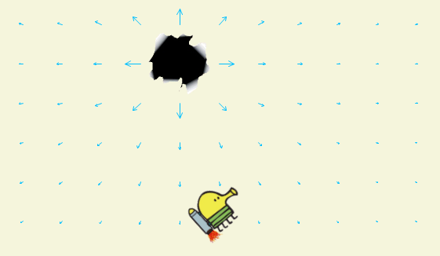

# Практика «Лямбды и делегаты»

Скачайте проект [rocket](rocket.zip).

В этой серии задач Каракуля на ракете очень хочет попасть в дыру, несмотря на все гравитационные аномалии!

<p float="left">

</p>

В этой задаче в классе ForcesTask нужно реализовать три вспомогательных метода, преобразующих одни делегаты в другие.

Чтобы лучше понимать зачем эти методы нужны, изучите проект, в частности места использования этих методов. Это будет полезно и для следующих заданий.

После выполнения этого задания, при запуске проекта Каракуля должен летать и управляться клавишами A и D.


Все тесты пройдены, задача сдана:
```cs
using System;

namespace func_rocket
{
    public class ForcesTask
    {
        public static RocketForce GetThrustForce(double forceValue)
        {
            return r => new Vector(forceValue * Math.Cos(r.Direction),
                                   forceValue * Math.Sin(r.Direction));
        }
   
        public static RocketForce ConvertGravityToForce(Gravity gravity, Vector spaceSize)
        { return r => gravity(spaceSize, r.Location); }
   
        public static RocketForce Sum(params RocketForce[] forces)
        {
            return r =>
            {
                double X = 0; double Y = 0;
                foreach (var force in forces)
                { X += force(r).X; Y += force(r).Y; }
                return new Vector(X, Y);
            };
        }
    }
}
```
