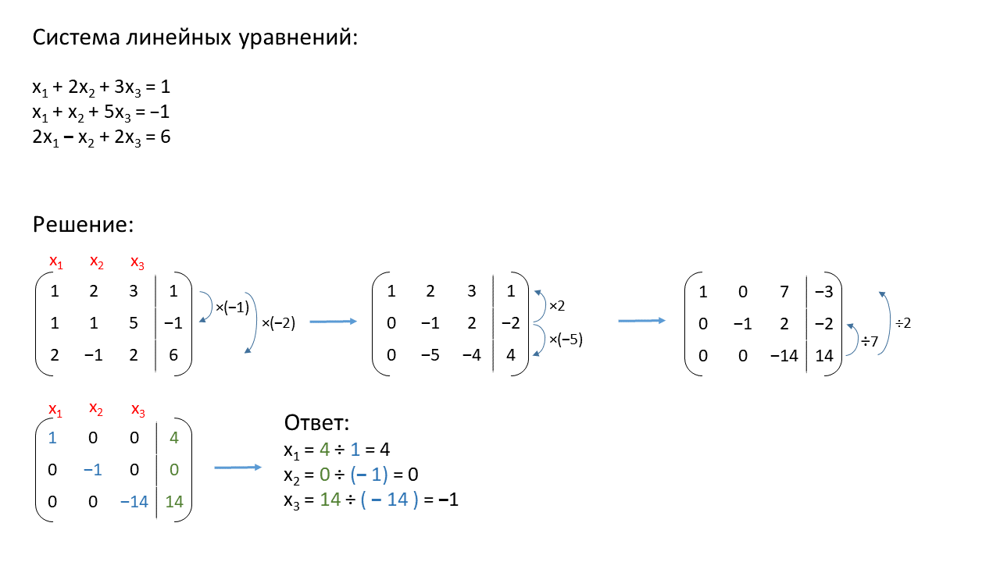

# Практика «Метод Гаусса»

Скачайте [проект GaussianAlgorithm](GaussAlgorithm.zip). Эта задача посложнее предыдущих.

Вам необходимо в методе `Solver.Solve` реализовать алгоритм решения системы линейных уравнений. Система передается методу Solve в виде матрицы коэффициентов перед неизвестными и в виде массива свободных членов. Возвращать Solve должен любое из возможных решений в виде массива значений неизвестных.

Для решения этой задачи используйте алгоритм Гаусса. Постарайтесь использовать методы LINQ для упрощения вашего кода.

Вам доступны модульные тесты для проверки своего решения. При наличии ошибок, начинайте отладку с самого простого непройденного теста.

**Алгоритм Гаусса**

Алгоритм Гаусса — это алгоритм решения системы линейных уравнений. Ниже описаны основные этапы работы этого алгоритма.
- Формируем матрицу из коэффициентов при неизвестных переменных и свободных членов. Ниже на иллюстрации свободные члены в матрице отделены линией для удобства.
- По очереди рассматриваем все столбцы слева направо
- Ищем ещё не использованную строку матрицы, в которой в нашем столбце находится ненулевой элемент. Помечаем ее, как использованную. Позже мы с помощью этой строки найдем значение переменной, соответствующей текущему столбцу.
- Если такой строки не нашлось, переходим к следующему столбцу. В этом случае неизвестная переменная, соответствующая этому столбцу может принимать любое значение, например, 0.
- Используем эту строку, чтобы получить нули во всех остальных строках в текущем столбце. Для этого складываем найденную строку с остальными строками, умножая её на подходящее число.
- После выполнения этого шага в текущем столбце должно остаться не более одного ненулевого значения.
- После того, как все столбцы рассмотрены, матрица должна иметь удобный вид, для того, чтобы вычислить значение всех неизвестных переменных.


<p float="left">

</p>

Комментарии к иллюстрации выше:
- Умножаем первую строку на -2 и -1 и прибавляем к третьей и второй
- Вторую строку умножаем на 2 и -5 и прибавляем к первой и второй
- Третью строку делим на 7 и 2 и прибавляем ко второй и первой
- Находим неизвестные переменные


**Где это применяется? «Рекомендации фильмов»**

Предположим вы разрабатываете рекомендательную систему для онлайн кинотеатра. Каждому фильму присвоена категория: комедия, трагедия, приключения, ужасы, поэзия и т.д. Каждый пользователь может ставить рассказу оценку от 0 до 10.

Проанализировав оценки, аналитики сайта поняли, что большинство пользователей делятся на несколько типажей: весельчаки (средняя оценка для комедий 9.7, для приключений 8.5, для ужасов 0.4 и т.п.), меланхолики (средняя оценка трагедий 8.2, поэзии 7.9, комедий 0.2 и т.п.) и ещё несколько. В реальности есть готовые алгоритмы, которые способны выделять подобные типажи из больших данных.

Естественно, не все пользователи точно подпадают под какой-то типаж; они, например, могут быть на 42% весельчаками, на 36% меланхоликами и ещё на сколько-то процентов кем-то другим. Но как определить по оценкам сколько процентов того или иного типажа в определенном человеке? Здесь нам и поможет алгоритм Гаусса!

Составляем систему линейных уравнений:
- Каждое уравнение описывает один жанр фильма.
- Неизвестные переменные — это определенный процент какого-то типажа у пользователя.
- Коэффициенты при неизвестных переменных — это средняя оценка типажа для жанра, соответствующему текущему уравнению.
- Свободный член — это средняя оценка человека для фильмов соответствующего жанра.

Решив эту систему методом Гаусса мы узнаем разложение нашего пользователя по типажам. Далее мы можем применять к нему рекомендации, составленные для его наиболее выраженных типажей.

**Где это применяется? «Реверс-инжиниринг химических растворов»**

Допустим у нас есть несколько растворов веществ. Мы полностью знаем состав каждого из растворов.

Хитрец смешал все наши растворы в неизвестных пропорциях. Мы тщательно изучили полученную смесь и узнали ее состав. Теперь мы хотим узнать, в какой пропорции Хитрец смешал исходные растворы.

Опять же составим систему линейных уравнений:
- i-ое уравнение описывает одно i-ое вещество.
- j-ая неизвестная переменная — это доля раствора j в нашей смеси.
- Коэффициент при j-ой неизвестной в i-ом уравнении — это количество i-ого вещества в j-ом растворе.
- i-ый свободный член — это количество i-ого вещества в нашей смеси.

Решив эту систему методом Гаусса, мы узнаем доли каждого раствора в изучаемой смеси.


Все тесты пройдены, задача сдана:
```cs
using System;
using System.Linq;

namespace GaussAlgorithm
{
    public class Solver
    {
        public double[] Solve(double[][] matrix, double[] freeMembers)
        { var system = new LinearEquationSystem(matrix, freeMembers); return system.Solve();}
    }
    
    public class LinearEquationSystem
    {
        private const double Epsilon = 1e-6;
        private readonly double[][] matrix;
        public int Height => matrix.Length;
        public int Width => Height > 0 ? matrix[0].Length - 1 : 0;
        private int preparedColumnsCount;
        private readonly bool[][] dependentVars;
        private int dependentVarsCount;
    
        public LinearEquationSystem(double[][] matrix, double[] freeMembers)
        {
            this.matrix = matrix.Zip(freeMembers, (m, f) => m.Concat(new double[]{f})
                                     .ToArray()).ToArray();
            dependentVars = new bool[Height][];
            for (var row = 0; row < Height; row++)
                dependentVars[row] = new bool[Width];
        }
    
        public void AddMultipliedLine(int resIndex, int addIndex, double multiplier)
        {
            for (var i = 0; i < Width+1; i++)
            {
                matrix[resIndex][i] += multiplier * matrix[addIndex][i];
                if (Math.Abs(matrix[resIndex][i]) < Epsilon) matrix[resIndex][i] = 0;
            }
        }
    
        public void MultiplyLine(int resIndex, double multiplier)
        { matrix[resIndex] = matrix[resIndex].Select(x => x * multiplier).ToArray(); }
    
        public void SwitchLines(int i, int j)
        {
            if (i < 0 || i >= Height || j < 0 || j >= Height) return;
    
            var tmpLine = matrix[i];
            matrix[i] = matrix[j];
            matrix[j] = tmpLine;
    
            var tmpLine2 = dependentVars[i];
            dependentVars[i] = dependentVars[j];
            dependentVars[j] = tmpLine2;
        }
    
        private bool RowOnlyContainsZeros(int row) => matrix[row].SkipLast(1).All(x => x == 0);
    
        private void PrepareColumn(int rowIndex, int columnIndex)
        {
            if (preparedColumnsCount == Width) return;
    
            if (rowIndex >= Height)
            { preparedColumnsCount++; return; }
    
            var divider = matrix[rowIndex][columnIndex];
            if (divider == 0)
            { PrepareColumn(rowIndex + 1, columnIndex); return; }
    
            MultiplyLine(rowIndex, 1 / divider);
            for (var row = 0; row < Height; row++)
            {
                if (row == rowIndex) continue;
                AddMultipliedLine(row, rowIndex, -matrix[row][columnIndex]);
            }
    
            dependentVars[rowIndex][columnIndex] = true;
            if (rowIndex != preparedColumnsCount)
                SwitchLines(rowIndex, preparedColumnsCount);
            preparedColumnsCount++;
            dependentVarsCount++;
        }
    
        public double[] Solve()
        {
            while (preparedColumnsCount < Width)
                PrepareColumn(dependentVarsCount, preparedColumnsCount);
    
            for (int row = 0; row < Height; row++)
                if (RowOnlyContainsZeros(row) && matrix[row].Last() != 0)
                    throw new NoSolutionException("No solution!");
    
            var solution = new double[Width];
            var definedVars = new bool[Width];
            
            for (var row = Height - 1; row >= 0; row--)
            {
                if (RowOnlyContainsZeros(row)) continue;
                var encounteredDependentVar = false;
                for (var column = Width - 1; column >= 0 && !encounteredDependentVar; column--)
                {
                    if (dependentVars[row][column])
                    {
                        var sum = 0.0;
                        for (var i = column + 1; i < Width; i++)
                            sum += matrix[row][i] * solution[i];
                        var tmp = (matrix[row].Last() - sum) / matrix[row][column];
                        solution[column] = tmp;
                        encounteredDependentVar = true;
                    }
                    else { if (!definedVars[column]) solution[column] = 0; }
                    definedVars[column] = true;
                }
            }
            return solution;
        }
    }
}
```
