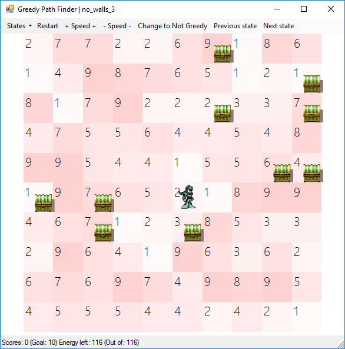

# Практика «Путь в лабиринте»

Скачайте [проект](Greedy.zip).

На этот раз в лабиринт с сокровищами попал Жадина! Лабиринт очень старый и все свободные клетки успели покрыться зарослями. Для каждой клетки лабиринта известна её трудность — количество сил, которые потратит Жадина на прохождение зарослей этой клетки.

После каждого шага силы Жадины уменьшаются на трудность клетки, в которую он шагнул. Когда силы заканчиваются, Жадина останавливается.

Посмотреть на лабиринты можно запустив проект:

<p float="left">

</p>

- Выбрать лабиринт можно в меню `States` слева сверху.
- Цифры и яркость на клетках — это трудность.

Жадина хочет узнать, какое минимальное количество сил ему нужно потратить чтобы дойти от текущей клетки до какого-то из сундуков. Причём, он ещё не решил, какой из сундуков он хочет посетить, так что Жадина хочет узнать кратчайшее расстояние до каждого из сундуков.

Помогите Жадине найти кратчайшие пути до каждого из сундуков!

Для того, чтобы сдать задачу, в файле `DijkstraPathFinder`.cs реализуйте метод `GetPathsByDijkstra`. Ему на вход поступают: лабиринт, начальная позиция Жадины, список целей — клеток, до которых нужно найти кратчайшие пути. Он должен возвращать пути до всех целей в виде `IEnumerable` в порядке увеличения трудности пути до них. При этом вычислять пути он должен лениво, то есть не вычислять пути до далёких сундуков и не обрабатывать весь лабиринт, пока это не запросили из `IEnumerable`.

Описание лабиринта передаётся в метод в объекте типа `State`:
- в поле `CellCost` находится двумерный массив трудностей всех клеток (0 означает стену).
- есть методы, которые помогут проверить, что какая-то клетка является стеной или находится внутри лабиринта.
- там же есть свойство `Chests`, но в данной задаче вместо него используйте список целей, переданный в метод аргументом.

Все тесты в классе `DijkstraPathFinder_Should` должны завершиться успехом.

Все тесты пройдены, задача сдана:
```cs
using System;
using System.Collections.Generic;
using Greedy.Architecture;
using System.Linq;

namespace Greedy;

public class DijkstraPathFinder
{
    public class DijkstraData
    {
        public Point Previous { get; set; }
        public int Cost { get; set; }
    }
    
    public IEnumerable<PathWithCost> GetPathsByDijkstra(State state, Point start,
        IEnumerable<Point> targets)
    {
        var visited = new HashSet<Point>();
        var targetHash = targets.ToHashSet();
        var track = new Dictionary<Point, DijkstraData>();
        track[start] = new DijkstraData { Cost = 0, Previous = new Point(-1, -1) };
    
        var notVisited = FindNeighbors(start, state, visited);
    
        while (true)
        {
            var toOpen = GetBestPoint(track, start, notVisited);
            if (notVisited.Count == 0) yield break;
            visited.Add(toOpen);
    
            if (targetHash.Contains(toOpen))
            {
                yield return ConvertPath(track,toOpen);
                targetHash.Remove(toOpen);
                if (!targetHash.Any()) yield break;
            }
            notVisited.Remove(toOpen);
            DijkstraCheckPath(state, track, toOpen, visited, notVisited);
        }
    }
    
    public Point GetBestPoint(Dictionary<Point, DijkstraData> track, Point start,
        HashSet<Point> notVisited)
    {
        var toOpen = start;
        int bestPrice = int.MaxValue;
        foreach (var v in notVisited)
        {
            if (track.ContainsKey(v) && track[v].Cost < bestPrice)
            {
                toOpen = v;
                bestPrice = track[v].Cost;
            }
        }
        return toOpen;
    }
    
    public void DijkstraCheckPath(State state, Dictionary<Point, DijkstraData> track, Point toOpen,
        HashSet<Point> visited, HashSet<Point> notVisited)
    {
        var neighbors = FindNeighbors(toOpen, state, visited);
        foreach (var e in neighbors)
        {
            var currentPrice = track[toOpen].Cost + state.CellCost[e.X, e.Y];
            if (!track.ContainsKey(e) || track[e].Cost > currentPrice)
                track[e] = new DijkstraData { Previous = toOpen, Cost = currentPrice };
        }
        UnionHashSet(notVisited, neighbors);
    }
    
    public void UnionHashSet(HashSet<Point> source, HashSet<Point> addition)
    {
        foreach (var a in addition)
            source.Add(a);
    }
    
    public PathWithCost ConvertPath(Dictionary<Point, DijkstraData> dictionaryPoint, Point end)
    {
        var pointList = new List<Point>();
        var cost = dictionaryPoint[end].Cost;
        while (end.X != -1)
        {
            pointList.Add(end);
            end = dictionaryPoint[end].Previous;
        }
        pointList.Reverse();
        return new PathWithCost(cost, pointList.ToArray());
    }
    
    public HashSet<Point> FindNeighbors(Point currentPoint, State state, HashSet<Point> visited)
    {
        var listPoint = new HashSet<Point>();
    
        for (var dy = -1; dy <= 1; dy++)
            for (var dx = -1; dx <= 1; dx++)
                if ((dx != 0 && dy != 0) || (dx == 0 && dy == 0)) continue;
                else
                {
                    var newPoint = currentPoint + new Point(dx, dy);
                    if (!state.InsideMap(newPoint)) continue;
                    if (state.IsWallAt(newPoint))
                    {
                        visited.Add(newPoint);
                        continue;
                    }
                    if (visited.Contains(newPoint)) continue;
    
                    listPoint.Add(currentPoint + new Point(dx, dy));
                }
        return listPoint;
    }
}
```
