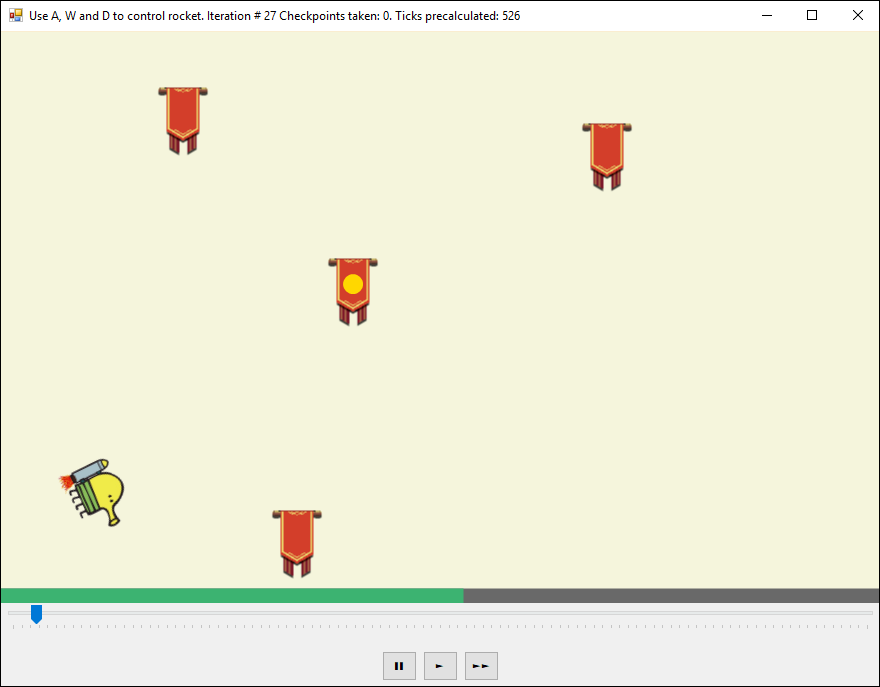

# Практика «Поток для AI»

Скачайте проект [rocket-bot](rocket-bot.zip). Запустите его.

У вас откроется окно приложения, в котором Каракуля на ракете должен облетать все флажки в заданном порядке.

<p float="left">

</p>

Каракулей можно управлять вручную кнопками `A`, `D` и `W`. Но в классе `Bot.cs` уже реализован искусственный интеллект: алгоритм, который сам довольно эффектно облетает флажки. Поскольку поиск лучшей управляющей команды для Каракули затратная операция, она делается в отдельном потоке, который запускается в классе `Program`. Алгоритм ищет оптимальную последовательность управления и сохраняет результаты своей работы в так называемый канал — объект класса `Channel`. Из этого канала результаты забирает поток пользовательского интерфейса (класс `GameForm`). Ручное управление также модифицирует содержимое канала.

Реализацией класса `Channel` вам и предстоит заняться. В файле `Channel.cs` вам нужно реализовать все методы в соответствии с их описанием.
Если вы внимательно смотрели видео-лекции, то уже догадались, что класс `Channel` должен быть потокобезопасным. То есть все его методы должны корректно работать, если их вызывают одновременно из нескольких разных потоков.

Отладьте свою реализацию на тестах `ChannelTests.cs`. После этого, при запуске приложения, Каракуля будет обходить флаги в нужном порядке.

**Интерфейс**

Внизу окна есть кнопки управления скоростью воспроизведения ходов, вычисленных алгоритмом управления.

Ползунок-трекбар позволяет перематывать полет Каракули назад и вперед.

Зеленая полоска показывает на сколько ходов вперед поток управления уже просчитал действия Каракули. Зеленая полоска может обгонять ползунок текущей позиции. А вот текущая позиция обгонять зеленую полоску не может.

Каждый раз, когда вы вмешиваетесь ручным управлением в полёт Каракули, зеленая полоска откатывается, ведь AI теперь должен пересчитать действия Каракули с момента последнего вмешательства. Если `Channel` реализован непотокобезопасно, то активное вмешательство в управление Каракулей может приводить к падению программы.

Все тесты пройдены, задача сдана:
```cs
using System.Linq;
using System.Collections.Generic;

namespace rocket_bot;

public class Channel<T> where T : class
{
    private T? lastItem;
    private readonly List<T> items = new List<T>();
    
    public T this[int index]
    {
        get
        {
            lock (this)
            {
                if (index < this.Count) return items.ElementAt(index);
                return null;
            }
        }
        set
        {
            lock (this)
            {
                if (index < Count)
                {
                    lastItem = value;
                    items[index] = value;
                    items.RemoveRange(index + 1, items.Count - index - 1);
                }
                else if (index == Count)
                {
                    lastItem = value;
                    items.Add(value);
                }
            }
        }
    }
    
    public T LastItem()
    {
        return lastItem;
    }
    
    public void AppendIfLastItemIsUnchanged(T item, T knownLastItem)
    {
        if (this.LastItem() == knownLastItem) this[Count] = item;
    }
    
    public int Count
    {
        get
        {
            return items.Count;
        }
    }
}
```
