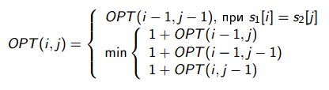

# Расстояние Левенштейна

Доделайте начатый алгоритм поиска расстояния Левенштейна. На вход алгоритм принимает две строки, а возвращает расстояние Левенштейна.

Расстояние Левенштейна — это минимальное количество правок (вставки, удаления или изменения одного символа на другой), которое нужно сделать, чтобы из первого слова получить второе.

<p float="left">

</p>

```cs
public static void Main()
{
    Assert.AreEqual(0, LevenshteinDistance("a", "a"));
    Assert.AreEqual(1, LevenshteinDistance("a", "aa"));
    Assert.AreEqual(2, LevenshteinDistance("кот", "клон"));
    Assert.AreEqual(3, LevenshteinDistance("yabx", "abcd"));
    Assert.AreEqual(4, LevenshteinDistance("студент", "солдат"));
    SecretTests();
    Console.WriteLine("OK");
}
```

Все тесты пройдены, задача сдана:
```cs
public static int LevenshteinDistance(string first, string second)
{
    var opt = new int[first.Length + 1, second.Length + 1];
    for (var i = 0; i <= first.Length; ++i)
        opt[i, 0] = i;
    
    for (var i = 0; i <= second.Length; ++i)
        opt[0, i] = i;
    
    for (var i = 1; i <= first.Length; ++i)
        for (var j = 1; j <= second.Length; ++j)
            if (first[i - 1] == second[j - 1]) 
                opt[i, j] = opt[i-1, j-1];
            else
                opt[i, j] = 1 + Math.Min(Math.Min(opt[i-1,j],opt[i,j-1]),opt[i-1,j-1]);
        
    return opt[first.Length,second.Length];
}
```

Вывод программы:
```cs
OK
```
