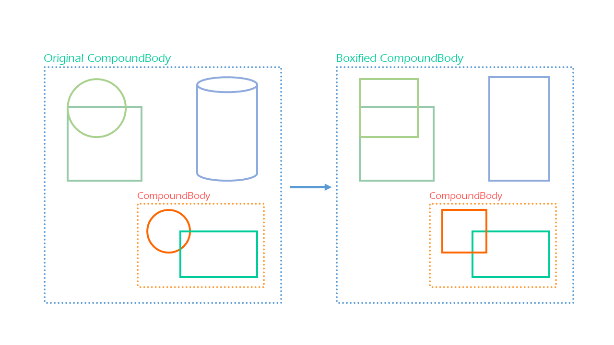

# Практика «Геометрия-2»

Давайте теперь предположим, что в предыдущей задаче новых геометрических примитивов добавлять мы не собираемся. Зато собираемся добавлять новые методы для работы с уже имеющимися — они могут вычислять минимальный ограничивающий прямоугольный параллелепипед, применять преобразования к фигурам или делать какие-либо другие операции: рассчитывать площадь поверхности, рассчитывать точку пересечения объекта с прямой и т.д.

В этом случае часто используется шаблон Visitor. [Изучите этот шаблон по википедии](https://ru.wikipedia.org/wiki/%D0%9F%D0%BE%D1%81%D0%B5%D1%82%D0%B8%D1%82%D0%B5%D0%BB%D1%8C_(%D1%88%D0%B0%D0%B1%D0%BB%D0%BE%D0%BD_%D0%BF%D1%80%D0%BE%D0%B5%D0%BA%D1%82%D0%B8%D1%80%D0%BE%D0%B2%D0%B0%D0%BD%D0%B8%D1%8F)).

Работайте в том же [проекте Inheritance.Geometry](Inheritance.Geometry.zip), в файле `Visitor\VisitorTask.cs`.

**IVisitor**

Определите интерфейс `IVisitor` и реализуйте его в двух классах:
1. `BoundingBoxVisitor`, вычисляющий минимальный ограничивающий прямоугольный параллелепипед. Для реализации этого класса можно воспользоваться ранее написанным методом `GetBoundingBox` из прошлой практики.
2. `BoxifyVisitor`, заменяющий все тела, кроме `CompoundBody`, на их ограничивающие прямоугольные параллелепипеды. Этот класс придется создать с нуля. Диаграмма ниже объясняет ожидаемое поведение этого класса:

<p float="left">  </p>

**Body.Accept**

В класс `Body` добавьте абстрактный метод `Accept` принимающий в качестве аргумента `IVisitor`.

Согласно шаблону Visitor этот метод будет использоваться, чтобы выполнять над фигурами разные операции, возможно даже такие, которые были не известны на момент создания иерархии фигур.

**Самопроверка**

Автоматизированные тесты проверяют лишь базовые требования. Проверить, что вы всё сделали правильно можно самостоятельно так:
1. В реализациях Visitor не должно быть ни одного приведения типов и ни одного if-а. Именно этой простотой решение с Visitor-ом лучше исходного с длинным if-else.
2. Работа с каждой фигурой должна оказаться в отдельном методе. А значит даже если добавится новая фигура, будет меньше возможностей случайно внести ошибку в обработку старых фигур.
3. Компилятор должен контролировать, что вы не забыли обработать ни одну из фигур: если вы забудете написать один из методов, программа даже не скомпилируется.
4. В интерфейсе `IVisitor`, в классе `Body` и всех его подклассах не должно быть никакого упоминания о прямоугольных параллелепипедах, замен фигур на них или конкретных классов Visitor-ов. А значит при добавлении новых расчетов, эти классы не нужно будет модифицировать.
5. Для добавления нового метода работы с фигурами, должно быть достаточно добавить новый класс Visitor-а.

Все тесты пройдены, задача сдана:
```cs
namespace Inheritance.Geometry.Visitor;

public abstract class Body
{
    public Vector3 Position { get; }
    
    protected Body(Vector3 position)
    {
        Position = position;
    }
    
    public abstract Body Accept(IVisitor visitor);
}

public class Ball : Body
{
    public double Radius { get; }
    
    public Ball(Vector3 position, double radius) : base(position)
    {
        Radius = radius;
    }
    
    public override Body Accept(IVisitor visitor) => visitor.Visit(this);
}

public class RectangularCuboid : Body
{
    public double SizeX { get; }
    public double SizeY { get; }
    public double SizeZ { get; }
    
    public RectangularCuboid(Vector3 position, double sizeX, double sizeY, double sizeZ) : base(position)
    {
        SizeX = sizeX;
        SizeY = sizeY;
        SizeZ = sizeZ;
    }
    
    public override Body Accept(IVisitor visitor) => visitor.Visit(this);
}

public class Cylinder : Body
{
    public double SizeZ { get; }
    
    public double Radius { get; }
    
    public Cylinder(Vector3 position, double sizeZ, double radius) : base(position)
    {
        SizeZ = sizeZ;
        Radius = radius;
    }
    
    public override Body Accept(IVisitor visitor) => visitor.Visit(this);
}

public class CompoundBody : Body
{
    public IReadOnlyList<Body> Parts { get; }
    
    public CompoundBody(IReadOnlyList<Body> parts) : base(parts[0].Position)
    {
        Parts = parts;
    }
    
    public override Body Accept(IVisitor visitor) => visitor.Visit(this);
}

public class BoundingBoxVisitor : IVisitor
{
    public Body Visit(Ball visitor)
    {
        return new RectangularCuboid(visitor.Position, 2 * visitor.Radius, 2 * visitor.Radius, 2 * visitor.Radius);
    }
    
    public Body Visit(RectangularCuboid visitor) => visitor;
    
    public Body Visit(Cylinder visitor)
    {
        return new RectangularCuboid(visitor.Position, 2 * visitor.Radius, 2 * visitor.Radius, visitor.SizeZ);
    }
    
    public virtual Body Visit(CompoundBody visitor)
    {
        var minX = double.MaxValue; var minY = double.MaxValue; var minZ = double.MaxValue;
        var maxX = double.MinValue; var maxY = double.MinValue; var maxZ = double.MinValue;
    
        foreach (var part in visitor.Parts)
        {
            var cuboid = (RectangularCuboid)part.Accept(this);
    
            minX = Math.Min(minX, cuboid.Position.X - cuboid.SizeX / 2);
            minY = Math.Min(minY, cuboid.Position.Y - cuboid.SizeY / 2);
            minZ = Math.Min(minZ, cuboid.Position.Z - cuboid.SizeZ / 2);
            maxX = Math.Max(maxX, cuboid.Position.X + cuboid.SizeX / 2);
            maxY = Math.Max(maxY, cuboid.Position.Y + cuboid.SizeY / 2);
            maxZ = Math.Max(maxZ, cuboid.Position.Z + cuboid.SizeZ / 2);
        }
    
        var sizeX = maxX - minX; var sizeY = maxY - minY; var sizeZ = maxZ - minZ;
        var position = new Vector3(minX + sizeX / 2, minY + sizeY / 2, minZ + sizeZ / 2);
    
        return new RectangularCuboid(position, sizeX, sizeY, sizeZ);
    }
}

public class BoxifyVisitor : BoundingBoxVisitor, IVisitor
{
    public override Body Visit(CompoundBody visitor)
    {
        return new CompoundBody(visitor.Parts.Select(s => s.Accept(this)).ToList());
    }
}

public interface IVisitor
{
    public Body Visit(Ball visitor);
    public Body Visit(RectangularCuboid visitor);
    public Body Visit(Cylinder visitor);
    public Body Visit(CompoundBody visitor);
}
```

**Проект со всеми внесенными решениями.**
[Inheritance.Geometry Edit](Inheritance.Geometry_Edit.zip)
