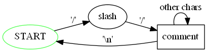

# Практика «GraphViz»

Скачайте проект [FluentApi.Graph](FluentApi.Graph.zip).

[GraphViz](https://www.graphviz.org/) — это широко распространённый набор утилит для визуализации графов. Для описания графов они используют текстовый формат *.dot (он же в прошлом *.gv). Вот [спецификация формата dot](https://graphviz.gitlab.io/doc/info/lang.html).

Пример графа в этом формате:

digraph CommentParser { START [color=green; shape=ellipse]; comment [shape=box]; START -> slash [label="'/'"]; slash -> comment [label="'/'"]; comment -> comment [label="other chars"]; comment -> START [label="'\n'"] }

По такому описанию GraphViz может сгенерировать такую картинку:

<p float="left">  </p>

*Кстати, если вам когда-то в будущем понадобится визуализация графов, то экономнее не программировать это самостоятельно, а воспользоваться одним из готовых инструментов: GraphViz даёт удобную работу из командной строки, а [Gephi](https://gephi.org/) — удобный графический интерфейс.*

В этой задаче предстоит создать fluent API для задания графов в dot-формате. Чтобы можно было сконцентрироваться исключительно на fluent API, в проекте уже реализованы вспомогательные классы (Graph, DotFormatWriter и другие). Не надо повторять код уже написанный в этих классах.

Примеры использования требуемого API ищите в тесте DotGraphBuilder_Tests.

**Детали**

В формате dot у вершин и ребер можно указывать значения атрибутов. Вот полный [список поддерживаемых атрибутов](https://graphviz.gitlab.io/doc/info/attrs.html). Из этого многообразия реализуйте поддержку только следующих:
- Для вершин: color, fontsize, label и shape;
- Для ребер: color, fontsize, label и weight.

Поскольку одна из целей fluent API — это служить документацией, то в API нигде не должно быть возможности обратиться к члену, непредусмотренному в данном контексте. Например, у вершины не должно быть возможности указать weight, а у ребра — shape. Это проверяется в секретных тестах проверяющей системы.

И как обычно, не допускайте дублирования кода в своём решении!

Все ссылки ещё раз:
- [GraphViz](https://www.graphviz.org/)
- [Спецификация формата dot](https://graphviz.org/doc/info/lang.html)
- [Список всех поддерживаемых атрибутов](https://graphviz.gitlab.io/doc/info/attrs.html)
- [Gephi](https://gephi.org/)

Все тесты пройдены, задача сдана:
```cs
using System.Reflection;
using System.Globalization;

namespace FluentApi.Graph
{
    public enum NodeShape
    {
        Box,
        Ellipse
    }
    
    public interface IDotGraphBuilder
    {
        INodeBuilder AddNode(string name);
        IEdgeBuilder AddEdge(string from, string to);
        string Build();
    }
    
    public interface INodeBuilder : IDotGraphBuilder
    {
        IDotGraphBuilder With(Action<NodeAttributes> addAttributes);
    }
    
    public class NodeAttributes : CommonAttributes<NodeAttributes>
    {
        public NodeAttributes(GraphNode node) : base(node.Attributes) { }
    
        public NodeAttributes Shape(NodeShape value) =>
            AddAttribute(MethodBase.GetCurrentMethod(), value.ToString().ToLower());
    }
    
    public interface IEdgeBuilder : IDotGraphBuilder
    {
        IDotGraphBuilder With(Action<EdgeAttributes> addAttributes);
    }
    
    public class EdgeAttributes : CommonAttributes<EdgeAttributes>
    {
        public EdgeAttributes(GraphEdge edge) : base(edge.Attributes) { }
    
        public EdgeAttributes Weight(double value) =>
            AddAttribute(MethodBase.GetCurrentMethod(), value.ToString(CultureInfo.InvariantCulture));
    }
    
    public abstract class CommonAttributes<T> where T : CommonAttributes<T>
    {
        private readonly Dictionary<string, string> attributes;
        protected CommonAttributes(Dictionary<string, string> attributes) => this.attributes = attributes;
        
        public T Color(string value) =>
            AddAttribute(MethodBase.GetCurrentMethod(), value);
    
        public T FontSize(int value) =>
            AddAttribute(MethodBase.GetCurrentMethod(), value.ToString());
    
        public T Label(string value) =>
            AddAttribute(MethodBase.GetCurrentMethod(), value);
    
        protected T AddAttribute(MethodBase method, string value)
        {
            attributes.Add(method.Name.ToLower(), value);
            return (T)this;
        }
    }
    
    public class DotGraphBuilder : INodeBuilder, IEdgeBuilder
    {
        private readonly Graph graph;
        private DotGraphBuilder(Graph graph) => this.graph = graph;
    
        public static IDotGraphBuilder DirectedGraph(string graphName) =>
            new DotGraphBuilder(new Graph(graphName, true, true));
    
        public static IDotGraphBuilder UndirectedGraph(string graphName) =>
            new DotGraphBuilder(new Graph(graphName, false, true));
    
        public INodeBuilder AddNode(string name)
        {
            graph.AddNode(name);
            return this;
        }
    
        public IEdgeBuilder AddEdge(string from, string to)
        {
            graph.AddEdge(from, to);
            return this;
        }
    
        public string Build() => graph.ToDotFormat();
    
        public IDotGraphBuilder With(Action<NodeAttributes> addAttributes)
        {
            addAttributes(new NodeAttributes(graph.Nodes.Last()));
            return this;
        }
    
        public IDotGraphBuilder With(Action<EdgeAttributes> addAttributes)
        {
            addAttributes(new EdgeAttributes(graph.Edges.Last()));
            return this;
        }
    }
}
```
