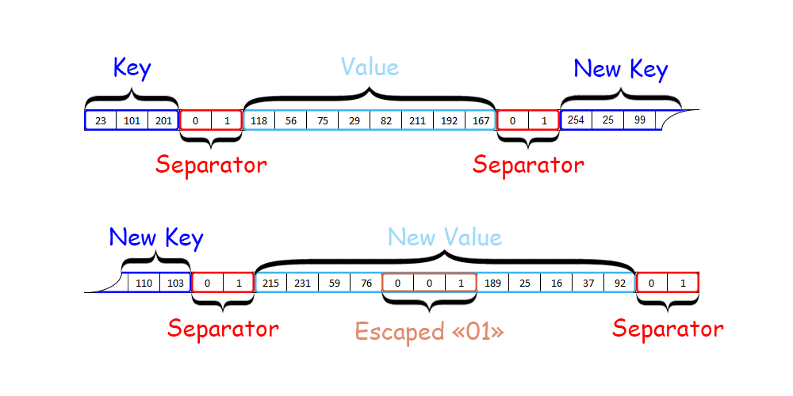

# Практика «Ресурсы»

Необходимость писать собственные стримы возникает не так уж и часто. Однако такие ситуации бывают.

Допустим, вы разрабатываете компьютерную игру использующую множество мелких файлов с картинками. И для оптимизации хотите хранить все мелкие файлы внутри одного большого и решили для этого использовать собственный формат файла.

Ваша задача — по известному формату написать стрим, который читает содержимое одного мелкого файла из большого. Более конкретно, ваш стрим должен получать в конструктор базовый стрим с содержимым большого файла, а также название мелкого файла. А чтение из вашего стрима должно возвращать содержимое мелкого файла.

Такой стрим удобен тем, что дальше его можно будет использовать во множестве стандартных функций, принимающих Stream, например, `Bitmap.FromStream`.

**Формат большого файла**

Большой файл состоит из последовательных секций. Секция содержит имя мелкого файла (Key) в кодировке ASCII и содержимое мелкого файла (Value) в виде произвольных байтов. Каждый Key и каждый Value (в том числе Value последней секции) должен заканчиваться разделителем (Separator) — двумя последовательными байтами 0 и 1.

<p float="left">  </p>

Мелкие файлы тоже могут содержать внутри себя последовательность 0, 1. Чтобы отличать ее от разделителя, все нулевые байты в Key и Value должны представляться удвоенными нулями. Это демонстрируется на иллюстрации выше, а также в соответствующем модульном тесте.

**Буферизация чтения**

Дополнительное ограничение: из базового стрима нужно читать порциями ровно по 1024 байт. Это нужно, потому что для некоторых стримов слишком часто читать маленькие участки не эффективно — сам факт чтения несет дополнительные расходы, в некоторых случаях не зависящие от количества прочитанных байт. С другой стороны плохо читать все сразу, поскольку стрим может быть очень большой и не поместиться в памяти. Такая техника называется буферизация. Постарайтесь не реализовывать буферизацию вручную, а найдите для этого стандартный способ.

Скачайте проект [Streams.Resources](Streams.Resources.zip). Детали формата можно посмотреть в конструкторе `TestStream`.

Все тесты пройдены, задача сдана:
```cs
using System.Text;

namespace Streams.Resources;

public class ResourceReaderStream : Stream
{
    private readonly Stream innerStream;
    private readonly byte[] key;
    private bool valueStartReached;
    private bool valueEndReached;
    
    public ResourceReaderStream(Stream stream, string key)
    {
        if (key.Equals("unknown")) throw new EndOfStreamException();
        innerStream = new BufferedStream(stream, Constants.BufferSize);
        this.key = Encoding.ASCII.GetBytes(key);
    }
    
    public override int Read(byte[] buffer, int offset, int count)
    {
        if (!valueStartReached) SeekValue();
        valueStartReached = true;
        if (valueEndReached) return 0;
        return ReadFieldValue(buffer, offset, count);
    }
    
    private void SeekValue()
    {
        var endOfStream = false;
        while (!endOfStream)
        {
            var found = ReadFieldAndCompare(key, out endOfStream);
            if (found) return;
            ReadFieldAndCompare(new byte[0], out endOfStream);
        }
        throw new EndOfStreamException();
    }
    
    private int ReadFieldValue(byte[] buffer, int offset, int count)
    {
        bool endOfStream;
        for (int i = 0; i < count; i++)
        {
            int b = DecodeByte(out endOfStream);
            if (b < 0)
            {
                valueEndReached = true;
                return i;
            }
            buffer[offset + i] = (byte)b;
        }
        return count;
    }
    
    private bool ReadFieldAndCompare(byte[] expectedField, out bool endOfStream)
    {
        var count = 0;
        var equal = true;
        while (true)
        {
            var b = DecodeByte(out endOfStream);
            if (b < 0) return equal && expectedField.Length == count;
            equal = equal && count < expectedField.Length && expectedField[count++] == b;
        }
    }
    
    private int DecodeByte(out bool endOfStream)
    {
        int first = innerStream.ReadByte();
        int last = first == 0 ? innerStream.ReadByte() : first;
        endOfStream = last == -1;
        if (endOfStream && (first != 0 || last != 1)) throw new EndOfStreamException();
        if (endOfStream || first == 0 && last == 1) return -1;
        return last;
    }
    
    public override void Flush() { }
    
    public override void Write(byte[] buffer, int offset, int count)
        => throw new NotSupportedException();
    
    public override long Seek(long offset, SeekOrigin origin)
        => throw new NotSupportedException();
    
    public override void SetLength(long value)
        => throw new NotSupportedException();
    
    public override bool CanRead => true;
    public override bool CanSeek => false;
    public override bool CanWrite => false;
    public override long Length => throw new NotSupportedException();
    public override long Position
    {
        get => throw new NotSupportedException();
        set => throw new NotSupportedException();
    }
}
```

**Самопроверка**<br>
Посмотрите, всё ли вы учли и отметьте сделанное
* ✅ Проверьте, что вы использовали BufferedStream в своём решении, а не реализовывали логику буфферизации вручную
* ✅ Проверьте, что логика обработки сдвоенных байтов не дублируется, а реализована только в одном месте
* ✅ Read может прочитать меньше байт, чем у него запросили. Проверьте, что ваше решение корректно работает в таких случаях 
