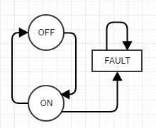
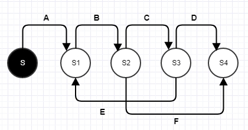
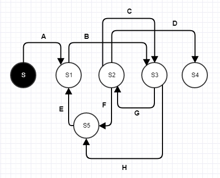
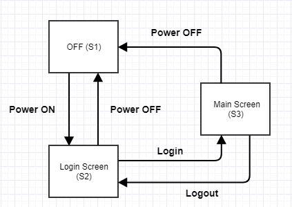
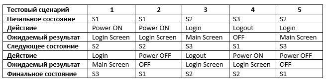

# Тест по теме: Диаграммы состояний и переходов

1. Из каких элементов может состоять диаграмма состояний и переходов? (1 из 1 балла)
   * ❌ **Сообщение**
   * ✅ **Состояние** (Правильно!)
   * ✅ **Точка выхода** (Правильно!)
   * ✅ **Действие** (Правильно!)
   * ❌ **Начало**
   * ❌ **Настройка**
   * ❌ **Конец**
   * ✅ **Точка входа** (Правильно!)
   * ✅ **Переход** (Правильно!)
   * ✅ **Событие** (Правильно!)

2. Дана диаграмма состояний и переходов (см. ниже) простого переключателя. Ниже представлены переходы из одного состояния в другое. Выбери неправильный(ые) переход(ы) относительно предложенной схемы: (1 из 1 балла)
   * ❌ **Из ON в FAULT**
   * ✅ **Из FAULT в ON** (Правильно! Из состояния FAULT можно перейти только в него же само.)
   * ❌ **Из OFF в ON**
   * ✅ **Из FAULT в OFF** (Правильно! Из состояния FAULT можно перейти только в него же само.)
   * ❌ **Из ON в OFF**

3. Дана диаграмма состояний и переходов (см. ниже). Выбери тестовый сценарий, который покроет следующий ряд состояний и переходов S-S1-S2-S3-S1-S2-S3-S4: (1 из 1 балла)
   * 🔴 **ABF**
   * 🔴 **ABCD**
   * 🟢 **ABCEBCD** (Правильно!)
   * 🔴 **ABCEBF**

4. Дана следующая диаграмма состояний и переходов. Выбери самый короткий тестовый сценарий для покрытия всех состояний: (1 из 1 балла)
   * 🔴 **S -> S1 -> S3 -> S2 -> S4**
   * 🟢 **S -> S1 -> S3 -> S5 -> S1 -> S3 -> S2 -> S4** (Правильно!)
   * 🔴 **S -> S1 -> S5 -> S3 -> S2 -> S4**
   * 🔴 **Правильного ответа нет**
   * 🔴 **S -> S1 -> S3 -> S5 -> S1 -> S3 -> S2 -> S5 -> S1 -> S3 -> S2 -> S4**

5. Дана диаграмма состояний и переходов и построенная на ее основе таблица с тестовыми сценариями. Изучи диаграмму и таблицу. Все ли тестовые сценарии описаны верно? Если в тестовых сценариях нет ошибок, в поле напиши слово "нет" (без кавычек). Если есть одна ошибка, то в поле напиши номер сценария, где встретилась ошибка, например "666" (без кавычек). Если ошибки встретились в нескольких местах, то в поле напиши номера сценариев через запятую, например "666,777" (без кавычек): (1 из 1 балла)
   * 🟢 `4` (Правильный ответ: Происходит действие "Logout", переход по которому в соответствии с диаграммой происходит в состояние "Login screen". А в таблице указан переход в состояние "OFF".)

