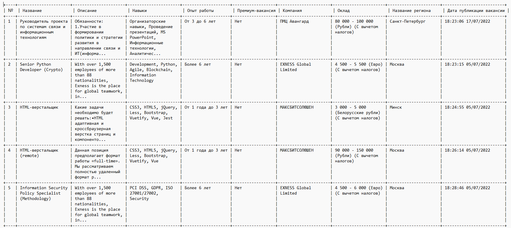

# Вакансии в табличке

После того, как Вася напечатал по-русски все вакансии, и даже сделал более читабельный формат данных, он радостный побежал в отдел аналитики сдавать свою работу, но не тут-то было...

Аналитики начали с усердием тестировать программу, и после того, как посмотрели, что выводит его программа сообщили Василию. Во-первых, он сделал совсем не ту программу которая им нужна, а во-вторых, она очень часто выдает ошибки, когда ее начинаешь тестировать на разных наборах данных. Отдали обратно Василию его программу и отправили восвояси.

Вася чуть не заплакал от досады, ведь он потратил столько времени на разработку программки и так хотел ей похвастатся, и сделать полезную программу для помощи аналитикам.

Он шел обратно к себе в отдел стажировок, не зная, что делать дальше... По дороге ему попалась Алена - старший программист в отделе аналитики. Спросила у него, почему он такой грустный, и Вася поведал ей о своих неудачах. На что Алена ответила, что это совершенно обычная ситуация при внедрении программных продуктов и ни в коем случае не надо огорчаться такой ситуации. Вместо этого, надо попытаться понять, в чем же конкретно все-таки его программа не подошла и что она делает не так. И посоветовала вместо того, чтобы сразу после получения задания кидаться и писать программу по понятным, казалось бы требованиям, нужно понять, как в глазах пользователей программа должна работать.

Вася внял ее советам и пошел снова в отдел аналитики узнавать, а какая все-таки программа им нужна. Девушки из отдела аналитики, оказались совсем не злыми и привередливыми и с удовольствием рассказывали о своей работе, кроме того, постоянно подкармливали его всякими вкусняшками. Пока Вася узнавал больше о работе аналитиков, ему больше нравилась их работа и он сам с удовольствием пошел в аналитики, если бы не программирование. В результате, Вася собрал все требования к своей программке и пошел ее переписывать.

Итак, что узнал Вася (Подробный формат вывода показан на изображении с табличкой):
- Нужно выводить все данные в виде таблички (он даже подобрал хороший модуль для Python, который красиво выводит таблички `PrettyTable`)
- Каждую строку необходимо пронумеровать
- В табличке нужно выводить границы вокруг всех ячеек.
- Для текста во всех ячейках таблицы с количеством превышающем `100` символов, сделать обрезку до `100` символов и добавить троеточие в конце "...".
- Ширину столбцов во всех ячейках сделать в максимальные 20 знакомест.
- В качестве входного значения, также подается строка с названием CSV-файла.
- В случае отсутствия записей в CSV-файле должна выводится подпись: `"Нет данных"`.


**Формат ввода**

Как в предыдущей задаче название CSV-файла c вакансиями [Скачать пример файла](example.zip)

**Формат вывода**

<p float="left">  </p>

|                         |               |
|:------------------------|:--------------|
| **Ограничение времени** | **1 секунда** |
| **Ограничение памяти**  | **64.0 Мб**   |


Все тесты пройдены, задача сдана:
```py
import csv
from prettytable import PrettyTable

work_experience = {
    "noExperience": "Нет опыта",
    "between1And3": "От 1 года до 3 лет",
    "between3And6": "От 3 до 6 лет",
    "moreThan6": "Более 6 лет"
}

currency = {
    "AZN": "Манаты",
    "BYR": "Белорусские рубли",
    "EUR": "Евро",
    "GEL": "Грузинский лари",
    "KGS": "Киргизский сом",
    "KZT": "Тенге",
    "RUR": "Рубли",
    "UAH": "Гривны",
    "USD": "Доллары",
    "UZS": "Узбекский сум"
}

def сsv_reader(file_name):
    vacancies = []
    with open(file_name, encoding='utf_8_sig') as csv_file:
        reader = csv.reader(csv_file)
        titles = next(reader)
        for row in reader:
            vacancy = {}
            for (key,value) in zip(titles,row):
                vacancy[key] = value
            vacancies.append(vacancy)
    return vacancies

def get_salary(salary_from, salary_to, salary_gross, salary_currency):
    salary_from = f"{int(float(salary_from)):,}".replace(',', ' ')
    salary_to = f"{int(float(salary_to)):,}".replace(',', ' ')
    salary_gross = "Без вычета налогов" if salary_gross == "True" else "С вычетом налогов"
    salary_currency = currency[salary_currency]
    return f"{salary_from} - {salary_to} ({salary_currency}) ({salary_gross})"

def formatter(vacancies):
    formatted_vacancies = []
    for vacancy in vacancies:
        result = {}
        result['Название'] = vacancy['name']
        result['Описание'] = vacancy['description'].rstrip()
        result['Навыки'] = ', '.join(vacancy['key_skills'].split('\n'))
        result['Опыт работы'] = work_experience[vacancy['experience_id']]
        result['Премиум-вакансия'] = "Да" if vacancy['premium'] == "True" else "Нет"
        result['Компания'] = vacancy['employer_name']
        result['Оклад'] = get_salary(vacancy['salary_from'],vacancy['salary_to'],
            vacancy['salary_gross'],vacancy['salary_currency'])
        result['Название региона'] = vacancy['area_name']
        result['Дата публикации вакансии'] = vacancy['published_at']

        formatted_vacancies.append(result)
    return formatted_vacancies

def create_table(vacancies):
    if not len(vacancies):
        return "Нет данных"

    table = PrettyTable()
    table.field_names = ["№"] + [title for title in vacancies[0].keys()]
    table.max_width = 20
    table.align = "l"
    fill_table(table, vacancies)
    return table

def fill_table(table, vacancies):
    for i in range(len(vacancies)):
        row = [info if len(info) <= 100 else info[:100] + "..." for info in vacancies[i].values()]
        number = i + 1
        row.insert(0, number)
        table.add_row(row, divider=True)

def main():
    file_name = input()
    vacancies = сsv_reader(file_name)
    formatted_vacancies = formatter(vacancies)
    table = create_table(formatted_vacancies)
    print(table)

if __name__ == "__main__":
    main()
```
