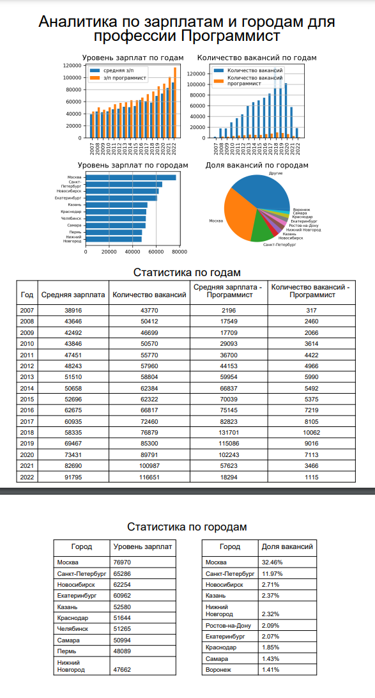

# Работа с PDF

**Продолжайте работу в том же проекте.**

Отдел аналитики всё никак не уймется. Теперь от Васи требуют PDF-файл с графиками и таблицами. Сделать это можно с помощью библиотеки [reportlab](https://www.reportlab.com/docs/reportlab-userguide.pdf).

Должна получиться программа, которая генерировала бы файл report.pdf, выполняющий следующие условия:
1. Сначала идет заголовок первого уровня: "Аналитика профессий по зарплатам и городам"
2. Далее идет по центру изображение с набором графиков graph.png.
3. Следом за графиком идут таблицы, как для report.xlsx

Размеры шрифтов, которые мы рекомендуем использовать:
1. На заголовке PDF-файла - 26.
2. На заголовках таблиц - 18.
3. На названиях колонок в таблицах - 12.
4. В ячейках - по умолчанию.

**Формат ввода**

```
Программист
```

**Формат вывода**

Пример итогового .pdf файла (данные на картинке могут отличаться):

<p float="left">  </p>

Итоговый файл нужно сохранить в папке 'student_works'.

*В качестве шрифта используйте Arial*

|                         |               |
|:------------------------|:--------------|
| **Ограничение времени** | **6 секунд**  |
| **Ограничение памяти**  | **1024.0 Мб** |


Все тесты пройдены, задача сдана:
```py
import re
import numpy as np
import pandas as pd
import openpyxl as op
from matplotlib import pyplot as plt
from matplotlib.axes import Axes
from openpyxl.workbook import Workbook
from openpyxl.utils.dataframe import dataframe_to_rows

from reportlab.pdfgen import canvas
from reportlab.lib.pagesizes import A4
from reportlab.lib import colors
from reportlab.platypus import Table, TableStyle
from reportlab.pdfbase import pdfmetrics
from reportlab.pdfbase.ttfonts import TTFont

def get_medium(x):
    if x['salary_from'].equals(x['salary_to']):
        return x['salary_from']
    return (x['salary_from'] + x['salary_to']) / 2

def get_year_vacancy(s):
    for j in re.findall(r'\d{4}-\d{2}-\d{2}T\d{2}:\d{2}:\d{2}\+\d{4}', s):
        s = s.replace(j, j[0:4])
    return int(s)

def get_vac_by_years(data):
    d = data.groupby(['published_at']).agg({
        'medium_salary': 'mean',
        'count': 'count',
    }).assign(medium_salary=lambda x: np.round(x['medium_salary']))
    return d

def get_vac_by_city(data):
    k = data.shape[0]
    d = (data.groupby(['area_name']).agg({
        'medium_salary': 'mean',
        'count': 'count',
    })
         .assign(count=lambda x: round(x['count'] / k * 100, 2))
         .query('count >= 1')
         .assign(medium_salary=lambda x: np.round(x['medium_salary'])))
    return (d.sort_values(['medium_salary', 'area_name'], ascending=(False, True))[:10]['medium_salary'],
            d.sort_values(['count', 'area_name'], ascending=(False, True))[:10]['count'])

def wrap_city_name(city):
    parts = city.replace('-', ' ').split()
    return "\n".join(parts)

def create_report(vacancies: pd.DataFrame):
    d = get_vac_by_years(vacancies)
    wb = Workbook()
    wb.create_sheet(title='Статистика по годам', index=0)
    wb.create_sheet(title='Статистика по городам', index=1)
    sheetnames = wb.sheetnames
    wb.remove(wb[sheetnames[2]])
    sheet = wb[sheetnames[0]]
    sheet.append(['Год', 'Средняя зарплата', 'Количество вакансий'])
    for i, r in enumerate(dataframe_to_rows(d, index=True, header=True)):
        if i >= 2:
            sheet.append(r)

    salary_vac, count_vac = get_vac_by_city(vacancies)
    sheet = wb[sheetnames[1]]
    sheet.append(['Город', 'Уровень зарплат'])
    for i, r in enumerate(dataframe_to_rows(pd.DataFrame(salary_vac), index=True, header=True)):
        if i >= 2:
            sheet.append(r)

    sheet.append(['Город', 'Доля вакансий, %'])
    for i, r in enumerate(dataframe_to_rows(pd.DataFrame(count_vac), index=True, header=True)):
        if i >= 2:
            sheet.append(r)
    sheet.move_range("A12:B22", rows=-11, cols=3)
    wb.save('student_works/report.xlsx')

def parse_csv(csv):
    names = ['name', 'salary_from', 'salary_to', 'salary_currency', 'area_name', 'published_at']
    vacancies = (pd.read_csv(csv, names=names)
                 .assign(salary_from=lambda x: x['salary_from'].fillna(x['salary_to']))
                 .assign(salary_to=lambda x: x['salary_to'].fillna(x['salary_from']))
                 .assign(published_at=lambda x: x['published_at'].apply(get_year_vacancy))
                 .assign(count=0)
                 .assign(medium_salary=get_medium))
    return vacancies

def create_plot(vacancies: pd.DataFrame, vac: str):
    fig, sub = plt.subplots(2, 2, figsize=(14, 8))
    vac_by_years = get_vac_by_years(vacancies)['medium_salary'].to_dict()
    vac_by_years_count = get_vac_by_years(vacancies)['count'].to_dict()
    vacancies_filtered = vacancies[vacancies['name'].str.contains(vac, na=False, case=False)]
    vac_by_years_filtered = get_vac_by_years(vacancies_filtered)['medium_salary'].to_dict()
    vac_by_years_filtered_count = get_vac_by_years(vacancies_filtered)['count'].to_dict()

    ax: Axes = sub[0, 0]
    years = sorted(vac_by_years.keys())
    x = np.arange(len(years))
    width = 0.3
    y_all = [vac_by_years.get(year, 0) for year in years]
    y_filtered = [vac_by_years_filtered.get(year, 0) for year in years]
    ax.bar(x - width / 2, y_all, width, label='средняя з/п')
    ax.bar(x + width / 2, y_filtered, width, label=f'з/п {vac}')
    ax.set_title('Уровень зарплат по годам', fontsize=8)
    ax.set_xticks(x)
    ax.set_xticklabels(years, rotation=90, fontsize=8)
    ax.tick_params(axis='y', labelsize=8)
    ax.legend(fontsize=8)
    ax.grid(True, alpha=0.3)

    ax = sub[0, 1]
    y_all_count = [vac_by_years_count.get(year, 0) for year in years]
    y_filtered_count = [vac_by_years_filtered_count.get(year, 0) for year in years]
    ax.bar(x - width / 2, y_all_count, width, label='Количество вакансий')
    ax.bar(x + width / 2, y_filtered_count, width, label=f'Количество вакансий {vac}')
    ax.set_title('Количество вакансий по годам', fontsize=8)
    ax.set_xticks(x)
    ax.set_xticklabels(years, rotation=90, fontsize=8)
    ax.legend(fontsize=8)
    ax.grid(True, alpha=0.3)

    ax = sub[1, 0]
    level_by_cities, count_by_cities = get_vac_by_city(vacancies)
    cities = list(level_by_cities.index)[:10]
    salaries = list(level_by_cities.values)[:10]
    y_pos = np.arange(len(cities))
    ax.barh(y_pos, salaries)
    ax.set_yticks(y_pos)
    ax.set_yticklabels(
        [wrap_city_name(c) for c in cities],
        fontsize=6,
        horizontalalignment='right',
        verticalalignment='center'
    )
    ax.tick_params(axis='x', labelsize=8)
    ax.set_title('Уровень зарплат по городам', fontsize=8)
    ax.invert_yaxis()
    ax.grid(True, alpha=0.3)

    ax = sub[1, 1]
    cities_count = list(count_by_cities.index)[:10]
    counts = list(count_by_cities.values)[:10]
    cities_count.append("Другие")
    counts.append(max(0.0, 100.0 - sum(counts)))
    ax.pie(counts, labels=cities_count, autopct='%1.1f%%', startangle=90, textprops={'fontsize': 6})
    ax.set_title('Доля вакансий по городам', fontsize=8)

    plt.tight_layout()
    plt.savefig("student_works/graph.png", dpi=200)
    plt.close()
    return sub

def draw_centered_title(pdf, text, top, size):
    pdf.setFont("Arial", size)
    w = pdf.stringWidth(text, "Arial", size)
    pdf.drawString((A4[0] - w) / 2, top, text)

def draw_table(pdf, data, y_start):
    tbl = Table(data)
    tbl.setStyle(TableStyle([
        ('GRID', (0, 0), (-1, -1), 1, colors.black),
        ('ALIGN', (0, 0), (-1, -1), 'CENTER'),
        ('FONTNAME', (0, 0), (-1, 0), 'Arial'),
        ('FONTSIZE', (0, 1), (-1, -1), 10),
    ]))
    tw, th = tbl.wrapOn(pdf, 0, 0)
    tbl.drawOn(pdf, (A4[0] - tw) / 2, y_start - th)
    return y_start - th - 20

def extract_table(ws):
    rows = []
    for r in ws.iter_rows(values_only=True):
        rows.append(list(r))
    return rows

def create_pdf():
    pdfmetrics.registerFont(TTFont("Arial", "Arial.ttf"))
    c = canvas.Canvas("student_works/report.pdf", pagesize=A4)
    W, H = A4
    y = H - 50
    draw_centered_title(c, "Аналитика профессий по зарплатам и городам", y, 26)
    y -= 60
    c.drawImage("student_works/graph.png", W * 0.2, y - 220, width=W * 0.6, height=220)
    y -= 250
    book = op.load_workbook("student_works/report.xlsx")
    ws_y = book["Статистика по годам"]
    ws_c = book["Статистика по городам"]
    y = draw_table(c, extract_table(ws_y), y)
    c.showPage()
    y = H - 40
    draw_table(c, extract_table(ws_c), y)
    c.save()

if __name__ == "__main__":
    csv = parse_csv("vacancies.csv")
    create_report(csv)
    vac = input()
    create_plot(csv, vac)
    create_pdf()
```
