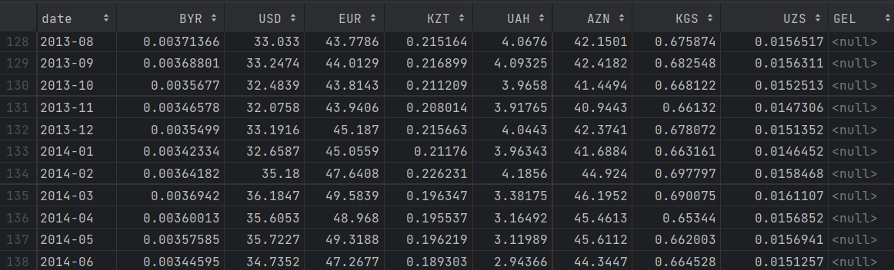

# API-Mining

Начальство так и не может отстать от Васи и придумывает ему новые задачи. На этот раз начальство заметило, что в тех вакансиях, что они собрали, находятся всякие разные валюты, и по хорошему хотелось бы получить все зарплаты в рублях. И не по текущему курсу, а по курсу валют на то время, когда была опубликована вакансия.

На счастье Васи, у Центрального Банка России есть [API](https://www.cbr.ru/development/SXML/), с помощью которого можно получить курсы валют в определенную дату.

Ваша задача - написать АПИ майнер, который соберет данные о валютах за период с 01.01.2003 до 01.11.2024 включительно, за первое число каждого месяца. У вас должен получиться csv-файл `currency.csv` со следующими полями:

`date,BYR,USD,EUR,KZT,UAH,AZN,KGS,UZS,GEL`

<p float="left">  </p>

*В качестве URL используйте http://127.0.0.1:8000/scripts/XML_daily.asp*

*Ответ сохраните в папке student_works*

|                         |               |
|:------------------------|:--------------|
| **Ограничение времени** | **30 секунд** |
| **Ограничение памяти**  | **512 Мб**    |


Все тесты пройдены, задача сдана:
```py
import pandas as pd

list_of_rows = []
list_of_charcodes = ["BYR","USD","EUR","KZT","UAH","AZN","KGS","UZS","GEL"]

for year in range(2003, 2024 + 1):
    for month in range(1, 12 + 1 if year != 2024 else 11 + 1):
        url = f"http://127.0.0.1:8000/scripts/XML_daily.asp?date_req=01/{month:02}/{year}&d=0"
        df = pd.read_xml(url, encoding='cp1251')
        df = df[['CharCode', 'VunitRate']]
        df['VunitRate'] = df['VunitRate'].str.replace(',', '.').astype(float)
        df = df[df['CharCode'].isin(list_of_charcodes)].set_index('CharCode').T
        df.insert(0, 'date', f"{year}-{month:02}")
        list_of_rows.append(df.to_dict(orient='records')[0])

result = pd.DataFrame(list_of_rows)
result.to_csv("student_works/currency.csv", index=False)
```
