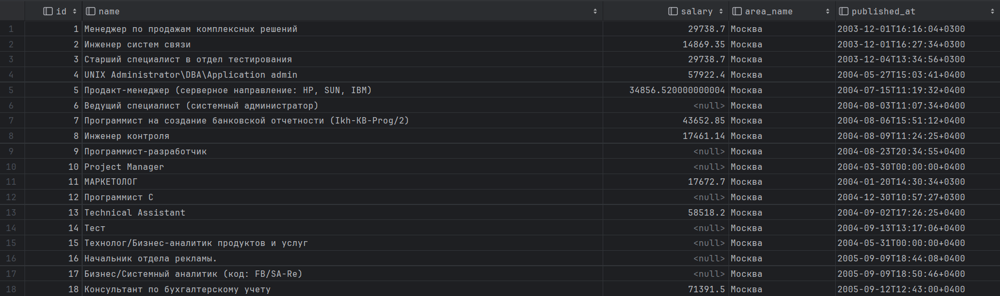

# Converter

*Продолжайте в том же проекте.*

Всё здорово! Вася получил [данные о валютах](valutes.zip) за кучу лет. Но это ещё только начало. Теперь необходимо обработать [данные о вакансиях](vacancies_dif_currencies.zip) следующим образом:
1. Если указано только одно из полей `salary_from`, `salary_to` то использовать это значение.
2. Если указаны оба, использовать их среднее.
3. Если не указано ни одно, то такая вакансия в обработке не участвует
4. Если валюта оклада не рубли, то перевести полученный в пунктах 1-3 средний оклад в рубли, по данным, из предыдущего задания (для каждой вакансии определить месяц и год, в который она была опубликована, и по этим данным взять нужный для этой валюты курс, в этот месяц).
5. Если для какой-то вакансии нет нужного курса в этот месяц, то такая вакансия в обработке не участвует

Полученный результат сохраните в базе данных SQLite, в папке student_works. Назовите базу данных `vacancies.db`. Назовите таблицу `vacancies`. В таблице должно получиться пять столбцов:
- id
- name
- salary
- area name
- published_at

<p float="left">  </p>

*В качестве URL используйте http://127.0.0.1:8000/scripts/XML_daily.asp*

*Ответ сохраните в папке student_works*

|                         |               |
|:------------------------|:--------------|
| **Ограничение времени** | **25 секунд** |
| **Ограничение памяти**  | **512 Мб**    |


Все тесты пройдены, задача сдана:
```py
import pandas as pd
import sqlite3

df_currency = pd.read_csv('valutes.csv', index_col='date')
csv_merged = pd.read_csv('vacancies_dif_currencies.csv')
result = pd.DataFrame(columns=['id', 'name', 'salary', 'area_name', 'published_at'])

def to_rub(df):
    salary, currency, date = df["salary"], df["salary_currency"], df["published_at"][:7]
    if currency == "RUR":
        return salary
    if salary > 0 and currency is not None and any(df_currency.index.isin([date])):
        value = df_currency[df_currency.index == date][currency].values[0]
        if value > 0:
            return salary * value
    return None

csv_merged['salary'] = csv_merged[['salary_from', 'salary_to']].mean(axis=1)
csv_merged['salary'] = csv_merged.apply(to_rub, axis=1)
result['name'] = csv_merged['name']
result['salary'] = csv_merged['salary']
result['area_name'] = csv_merged['area_name']
result['published_at'] = csv_merged['published_at']
result['id'] = range(1, len(result) + 1)

conn = sqlite3.connect('student_works/vacancies.db')
result.to_sql('vacancies', conn, index=False)
conn.close()
```
